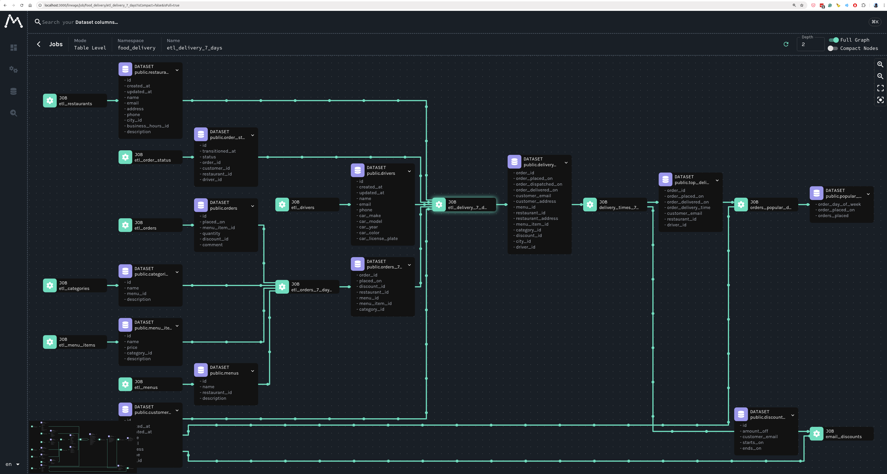

### Install Marquez

```bash
git clone https://github.com/MarquezProject/marquez && cd marquez
```

optionaly can add as sub-module:
```bash
git submodule add https://github.com/MarquezProject/marquez marquez
```

### Run Marquez

```bash
./docker/up.sh --seed
```

### Open Marquez

http://localhost:3000



### Install Airflow, send data to Marquez

1. Run Marquez

```bash
git clone https://github.com/MarquezProject/marquez && cd marquez
 ./docker/up.sh --db-port 2345
```

2. Configure Airflow

```bash
export AIRFLOW__OPENLINEAGE__TRANSPORT='{"type": "http", "url": "http://localhost:5000", "endpoint": "api/v1/lineage"}'

export AIRFLOW__OPENLINEAGE__NAMESPACE='my-team-airflow-instance'
```

3. Install OpenLineage

```bash
pip install apache-airflow-providers-openlineage 
pip install apache-airflow-providers-postgres
```

4. Run Airflow

```bash
docker run --rm --name airflow apache/airflow:latest webserver
```

5. Run Postgres

```bash
docker run --name postgres -e POSTGRES_PASSWORD=yourpassword postgres
```

6. Add dags to Airflow

7. Look at Marquez UI