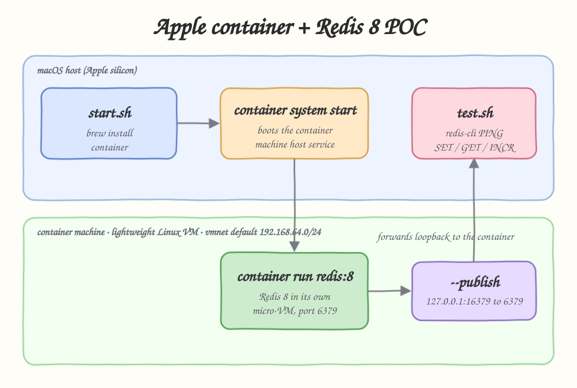

# Apple `container` + Redis 8 POC

A small proof of concept that uses **Apple's `container`** tool to spin up a Linux
container machine on macOS, run **Redis 8** inside it, and talk to it from the host
with `redis-cli`.

Apple `container`: https://github.com/apple/container
Docs: https://apple.github.io/container/documentation/



## What is Apple `container`?

`container` is an open source tool from Apple to create and run Linux containers on
macOS, optimized for Apple silicon. Unlike a single shared Linux VM, `container`
gives **each container its own lightweight virtual machine** (a "container machine").
That VM boots in a fraction of a second, gets a dedicated IP address on a private
`vmnet` network (`192.168.64.0/24` by default), and is torn down when the container
stops.

Key ideas used in this POC:

- `container system start` boots the host service that manages the container machines.
- `container run` boots one micro-VM per container and runs an OCI image inside it.
- Each container is reachable directly on its own IP, and `--publish` forwards a host
  loopback port into the container so plain `redis-cli` on the Mac can connect.

## Requirements

- Apple silicon Mac (arm64).
- macOS 15 or newer (this POC was run on macOS 26).
- [Homebrew](https://brew.sh) for installation.
- `redis-cli` on the host (`brew install redis`).

## Install

`start.sh` installs `container` automatically if it is missing. To install it by hand:

```bash
brew install container
```

The first `container system start` downloads a default Linux kernel. This POC passes
`--enable-kernel-install` so it happens without an interactive prompt.

## Project layout

| File              | Purpose                                                              |
| ----------------- | ------------------------------------------------------------------- |
| `start.sh`        | Install `container`, start the service, pull and run Redis 8.        |
| `test.sh`         | Run `redis-cli` against the Redis container machine.                 |
| `stop.sh`         | Stop and remove the Redis container machine.                         |
| `architecture.svg`| Hand-drawn flow diagram of the POC.                                  |

## How to use

```bash
./start.sh
./test.sh
./stop.sh
```

## How this POC works

`start.sh`:

1. Checks the host is arm64 and installs `container` via Homebrew when missing.
2. Runs `container system start --enable-kernel-install` to boot the container
   machine host service.
3. Pulls `docker.io/library/redis:8`.
4. Removes any leftover `redis8` container, then runs a fresh one detached with
   `--publish 127.0.0.1:16379:6379`, mapping host port `16379` to Redis port `6379`
   inside the VM (host port `16379` avoids clashing with a local Redis on `6379`).
5. Loops on `redis-cli ping` (max 1s per try) until Redis answers `PONG`.

`test.sh` lists the running container machine (you can see its `192.168.64.x` IP),
prints the Redis server version running inside the VM, then runs `PING`, `SET`,
`GET`, and `INCR` through `redis-cli` over the published port.

`stop.sh` stops and removes the `redis8` container machine. The host service keeps
running so it is ready for the next `start.sh`; stop it fully with
`container system stop`.

## Run output

`./start.sh` (trimmed):

```
container CLI version 1.0.0 (build: release, commit: unspeci)
Starting the container system service (the container machine host)...
Installing kernel...
Pulling Redis 8 image: docker.io/library/redis:8
Running Redis 8 inside its own container machine...
redis8
Waiting for Redis to accept connections on 127.0.0.1:16379...
Redis 8 is up and reachable on 127.0.0.1:16379

ID      IMAGE                      OS     ARCH   STATE    IP               CPUS  MEMORY   STARTED
redis8  docker.io/library/redis:8  linux  arm64  running  192.168.64.2/24  4     1024 MB  2026-06-11T04:59:27Z
```

`./test.sh`:

```
Container machines currently running:
ID      IMAGE                      OS     ARCH   STATE    IP               CPUS  MEMORY   STARTED
redis8  docker.io/library/redis:8  linux  arm64  running  192.168.64.2/24  4     1024 MB  2026-06-11T04:59:27Z

redis-cli version on host:
redis-cli 8.4.0

PING ->
PONG

Redis server version running inside the container machine:
redis_version:8.8.0

SET poc:key ->
OK
GET poc:key ->
apple-container-redis8

INCR poc:counter twice ->
1
2
GET poc:counter ->
2

Keys stored:
poc:counter
poc:key
```

`./stop.sh`:

```
Stopping redis8...
Removing redis8...

Remaining containers:
ID  IMAGE  OS  ARCH  STATE  IP  CPUS  MEMORY  STARTED

The container machine service is still running.
To stop the whole service run: container system stop
```

## Useful commands

```bash
container ls                       # running container machines and their IPs
container ls --all                 # include stopped ones
container inspect redis8           # full JSON, including networks[].address
container logs redis8              # Redis logs from inside the VM
container system status            # host service status
container system stop              # stop the whole container machine service
```

## Connect directly to the container machine IP

Because each container machine owns an IP, you can skip the published port and reach
Redis straight on its VM address:

```bash
redis-cli -h 192.168.64.2 -p 6379 ping
```

## Links

- Apple `container`: https://github.com/apple/container
- Documentation: https://apple.github.io/container/documentation/
- Releases: https://github.com/apple/container/releases
- Redis: https://hub.docker.com/_/redis
