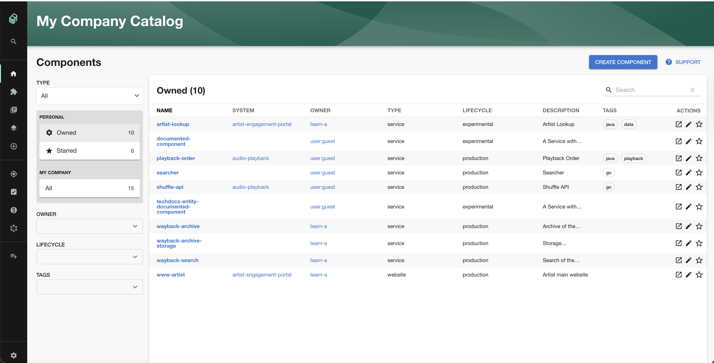
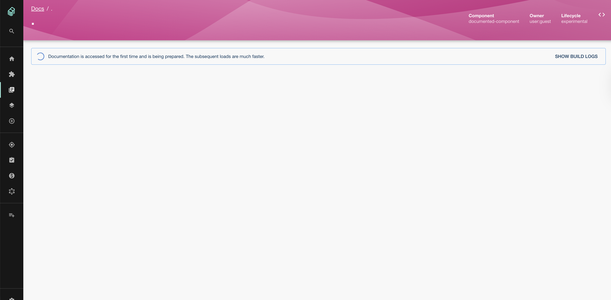
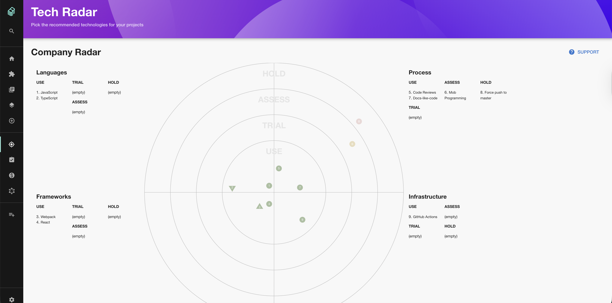
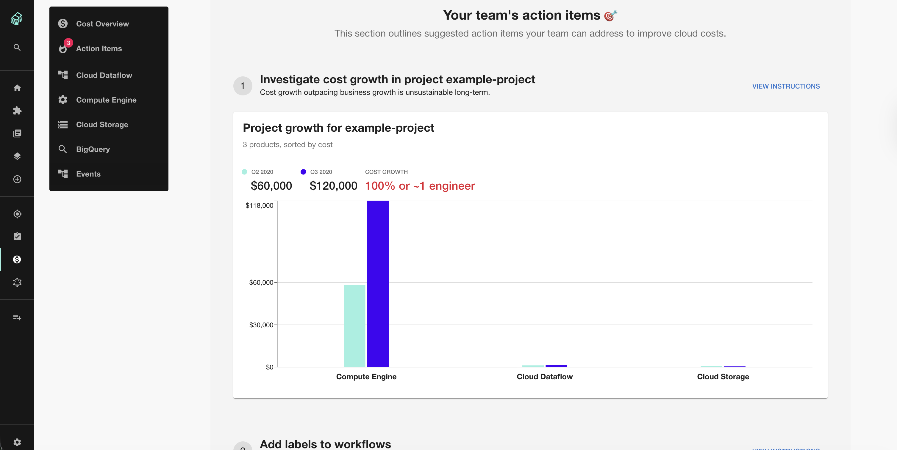
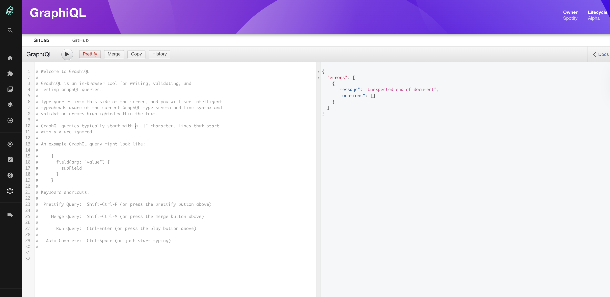
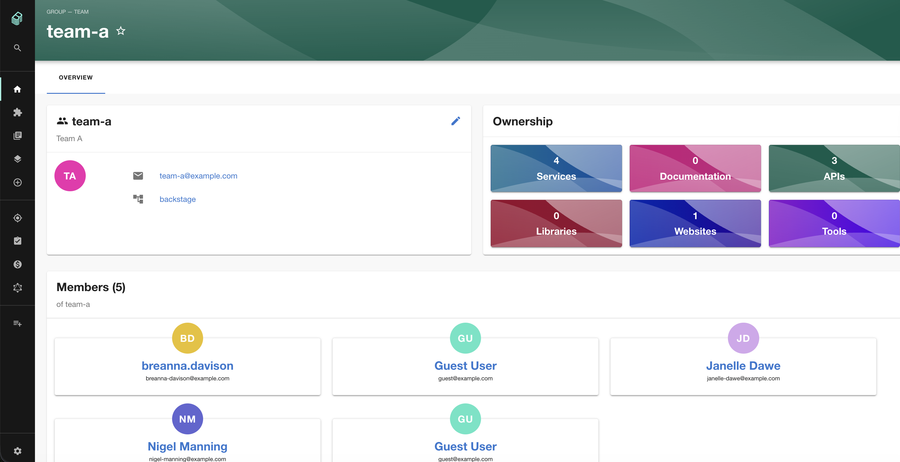

# Backstage Fun

Running Backstage locally using podman with Kind Kubernetes cluster integration.

| Catalog | APIs | Docs | Tech Radar | Cost | GraphQL | Teams & Ownership |
|---------|------|------|------------|------|---------|-------------------|
|  |  |  |  |  |  |  |

## Prerequisites

* podman installed
* kind installed
* kubectl installed
* Port 3000 available

## Structure

```
├── catalog/           
│   ├── apis.yaml         # 4 API definitions (orders, inventory, payments, users)
│   ├── components.yaml   # 5 service components with K8s annotations
│   ├── groups.yaml       # 4 team groups
│   └── systems.yaml      # 2 systems and 2 domains
├── k8s/               
│   ├── backstage-sa.yaml # Service account for K8s integration
│   └── services.yaml     # 5 deployments matching catalog components
├── templates/         
│   └── java-service/     # Java Spring Boot software template
├── app-config.yaml       # Backstage configuration
├── kind-config.yaml      # Kind cluster configuration
├── run.sh                # Start everything and open browser
├── stop.sh               # Stop and cleanup
└── test.sh               # Verify setup
```

## How to Run

```bash
./run.sh
```

This will:
1. Create a Kind cluster named backstage-cluster
2. Deploy 5 sample services to the cluster
3. Start Backstage with catalog preloaded
4. Open browser at http://localhost:3000

## Catalog Contents

Components:
* orders-service - Order processing (Java/Spring Boot)
* inventory-service - Inventory management (Java/Spring Boot)
* payments-service - Payment processing (Go)
* users-service - User management (Python/FastAPI)
* web-frontend - Web application (React/TypeScript)

APIs:
* orders-api - Order management REST API
* inventory-api - Inventory REST API
* payments-api - Payment processing REST API
* users-api - User management REST API

Systems:
* ecommerce - E-commerce platform
* identity - Identity and access management

Templates:
* Java Spring Boot Service - Create new Java microservices

## Access

* Catalog: http://localhost:3000/catalog
* APIs: http://localhost:3000/api-docs
* Create: http://localhost:3000/create
* Kubernetes: Click any component > Kubernetes tab

## Test

```bash
./test.sh
```

## Stop

```bash
./stop.sh
```
