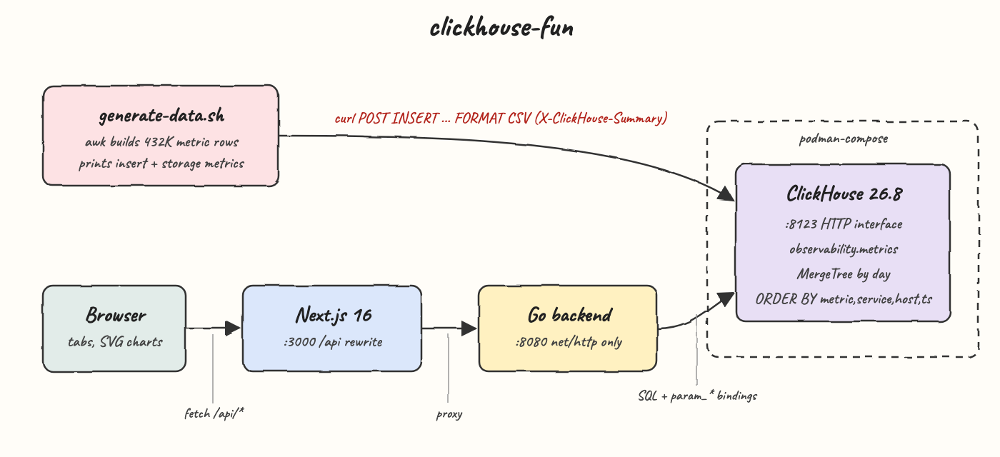
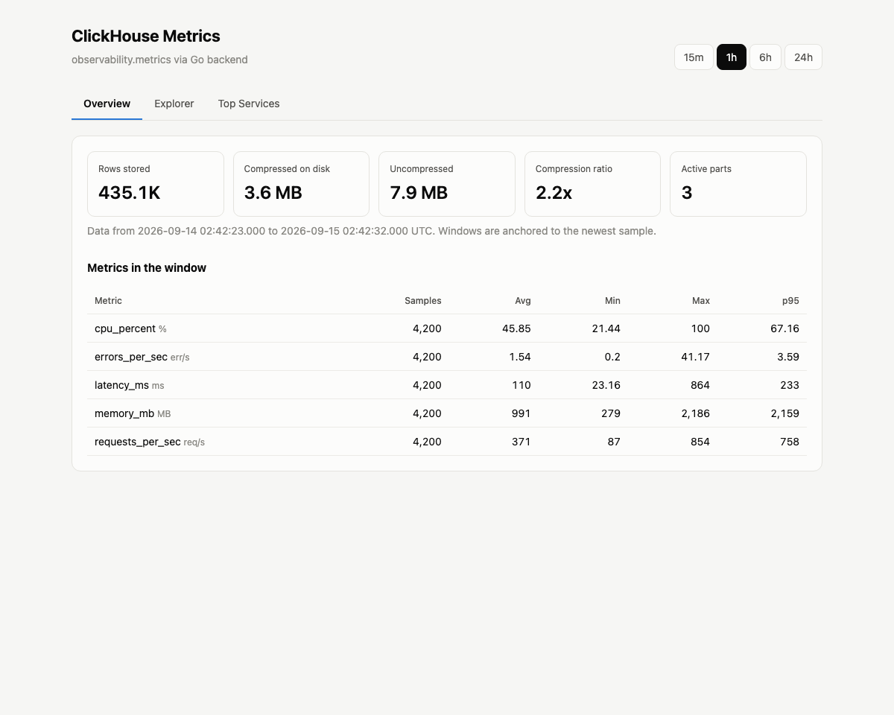
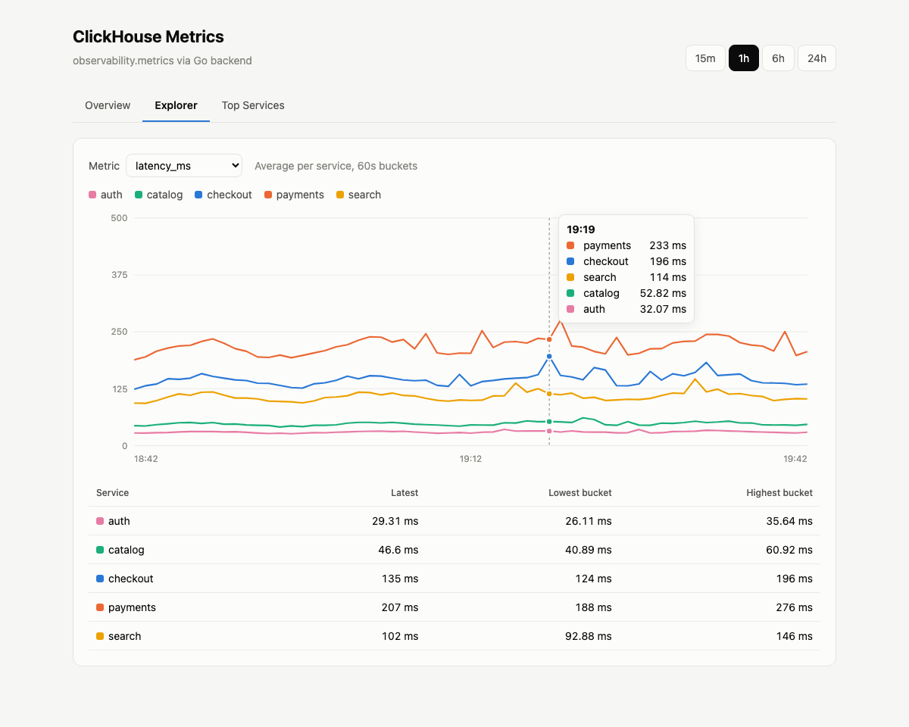
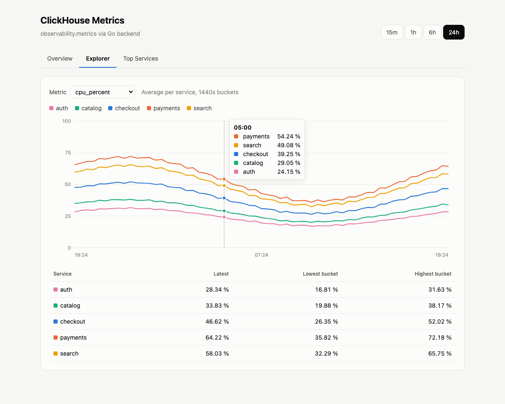
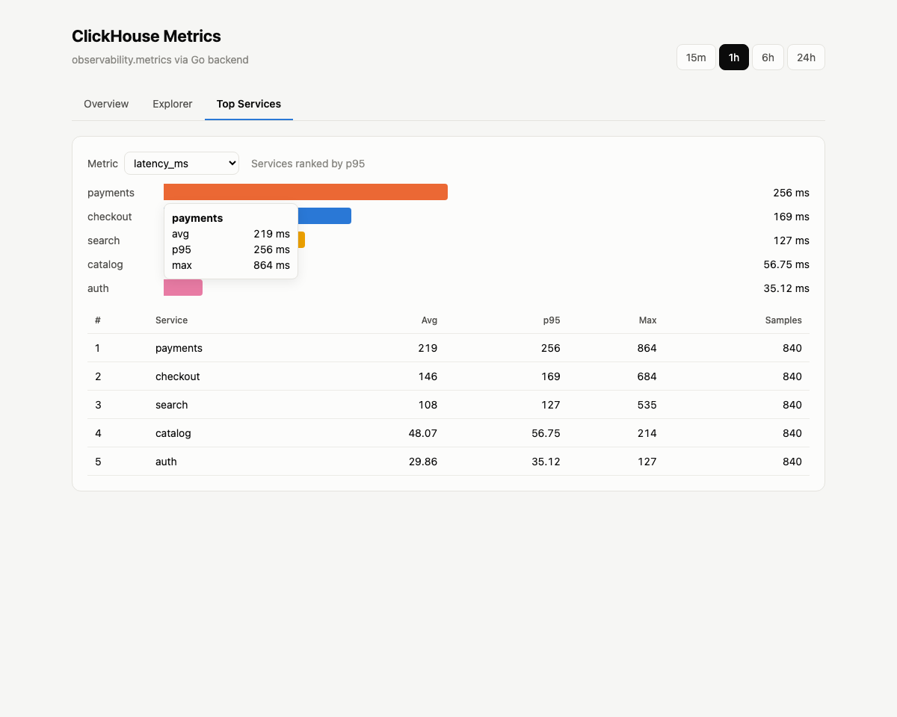

A proof of concept that stores service metrics in **[ClickHouse](https://clickhouse.com/)** running on **podman-compose**, loads them with `generate-data.sh`, queries them from a **Go** backend that uses only the standard library, and charts them in a **Next.js 16** dashboard.

## How it Works?

`podman-compose` starts ClickHouse 26.8 and runs `clickhouse/init.sql`, which creates `observability.metrics`, a MergeTree table partitioned by day.

`generate-data.sh` uses `awk` to build 24 hours of samples, one every 10 seconds, for 5 services with 2 hosts each and 5 metrics per host: 432K rows. The values follow a daily cycle with noise and occasional spikes. The CSV is streamed into ClickHouse's HTTP interface with a single `curl` INSERT. The script then prints the insert stats from the `X-ClickHouse-Summary` response header, storage stats from `system.parts`, and avg/p95 per metric.

The Go backend serves six JSON endpoints. Each one sends SQL to ClickHouse over HTTP, with user input passed as `param_*` query bindings, and decodes the `FORMAT JSON` envelope. There is no ClickHouse driver.

The Next.js app rewrites `/api/*` to the backend, so the browser never needs CORS. It has three tabs: Overview, Explorer and Top Services. Charts are hand-written SVG, with no chart library.

## Architecture



## Features

- **Metrics printed by `generate-data.sh`**: rows and bytes written, insert time, rows per second, compression ratio, active parts and avg/p95 per metric.
- **One HTTP INSERT for 432K rows**: ClickHouse ingests the whole day of data in about 250 ms on a laptop.
- **SQL injection safe by construction**: every user-supplied value reaches ClickHouse as a typed `{name:Type}` parameter, never as SQL text.
- **Windows anchored to the newest sample**: the 15m/1h/6h/24h windows still show data hours after it was generated.
- **About 60 buckets per chart**: the bucket size grows with the window, so the 15m and 24h charts are equally readable.
- **Storage insight**: the Overview tab shows compressed vs uncompressed size and the part count straight from `system.parts`.
- **Hover crosshair and tooltips**: the line chart snaps to the nearest bucket, and bars show avg, p95 and max.
- **Integration test through every layer**: `test-all.sh` generates data, then checks that the row count grew by exactly that amount through both the backend and the Next.js proxy.

## Stack

- **ClickHouse 26.8.4**: a columnar OLAP database built for time series aggregations like these.
- **podman 5 + podman-compose**: runs ClickHouse without a docker daemon.
- **Go 1.26, standard library only**: `net/http` handles both routing and ClickHouse's HTTP interface, so there are no dependencies.
- **Next.js 16.3 + React 19.3**: the dashboard, with `rewrites` proxying the API.
- **TypeScript 6.0**: types for the frontend, and the unit tests run directly with `node --test` using Node 24 type stripping.
- **bash + awk + curl**: data generation and ops scripts, with nothing to install.

## Contracts / APIs

Backend on `:8080`, also reachable through the frontend at `:3000/api/*`.

| Method | Endpoint | Params | Returns |
| --- | --- | --- | --- |
| `GET` | `/api/health` | | `{"status":"up"}` after `SELECT 1` succeeds |
| `GET` | `/api/stats` | | `rows`, `first_ts`, `last_ts`, `compressed_bytes`, `uncompressed_bytes`, `parts` |
| `GET` | `/api/metrics` | | `[{metric, samples, services}]` |
| `GET` | `/api/summary` | `minutes` 1-1440, default 60 | `[{metric, samples, avg, min, max, p95}]` |
| `GET` | `/api/timeseries` | `metric` required, `minutes` | `{metric, minutes, step, series:[{service, points:[{t, v}]}]}`, where `t` is epoch ms |
| `GET` | `/api/top` | `metric` required, `minutes`, `limit` 1-50, default 5 | `[{service, avg, p95, max, samples}]` ordered by p95 desc |

Invalid params return `400 {"error": "..."}`. ClickHouse failures return `502 {"error":"clickhouse query failed"}`, and the real error is logged but never sent to the client.

```bash
curl "localhost:8080/api/top?metric=latency_ms&minutes=60&limit=3"
```

```json
[{"service":"payments","avg":219.44,"p95":256.01,"max":863.62,"samples":840},
 {"service":"checkout","avg":146.26,"p95":169.15,"max":684.2,"samples":840},
 {"service":"search","avg":108.25,"p95":127.21,"max":535.45,"samples":840}]
```

## Key data structures and design decisions

**The table.** One narrow table holds every metric, one row per sample.

```sql
CREATE TABLE observability.metrics
(
    ts DateTime64(3),
    service LowCardinality(String),
    host LowCardinality(String),
    metric LowCardinality(String),
    value Float64
)
ENGINE = MergeTree
PARTITION BY toYYYYMMDD(ts)
ORDER BY (metric, service, host, ts)
TTL toDateTime(ts) + INTERVAL 30 DAY;
```

| Choice | Why |
| --- | --- |
| `ORDER BY (metric, service, host, ts)` | Every query filters by metric first, so the primary index skips the other metrics' data. |
| `LowCardinality(String)` | services, hosts and metric names are a handful of values, so they are dictionary encoded. |
| `PARTITION BY toYYYYMMDD(ts)` + `TTL 30 DAY` | Old days are dropped whole instead of being deleted row by row. |
| Narrow table instead of a column per metric | New metrics need no schema change. |

**Why the HTTP interface instead of a driver.** ClickHouse already speaks JSON over HTTP, and its `param_<name>` URL arguments bind `{name:Type}` placeholders on the server. That gives the backend safe parameterized queries with `net/http` alone. `output_format_json_quote_64bit_integers=0` makes counts come back as JSON numbers, so they decode straight into `uint64`.

**Why windows are anchored to `max(ts)`.** `ts > (SELECT max(ts) FROM metrics) - toIntervalMinute({minutes:UInt32})` keeps the dashboard populated no matter when `generate-data.sh` last ran. Windows relative to `now()` would go empty a few minutes after generation.

**Why the step is `max(10, minutes)` seconds.** `minutes * 60 / minutes = 60` buckets for every window. The 10 second floor matches the sample interval, so a bucket is never empty.

**Why the frontend proxies.** `next.config.ts` rewrites `/api/*` to `BACKEND_URL`, so the browser only talks to one origin and the backend needs no CORS code.

## How to run

Prerequisites: podman with a running machine, podman-compose, Go 1.26, Node 24.

```bash
./scripts/setup.sh        # pull clickhouse, build backend, npm install
./scripts/start-all.sh    # clickhouse, backend, frontend
./generate-data.sh        # 24h of metrics every 10s, prints ingestion metrics
./generate-data.sh 6 30   # or: 6 hours, one sample every 30 seconds
./scripts/test-all.sh     # go unit tests, frontend unit tests, integration checks
./scripts/ui.sh           # open http://localhost:3000
./scripts/stop-all.sh
```

`generate-data.sh` output:

```
generating 24 hours of metrics every 10 seconds for 5 services, 2 hosts each

insert metrics
  rows written           432050
  bytes written          8209676
  insert elapsed         245 ms
  rows per second        1763469

table metrics
  total rows             432.05 thousand
  uncompressed size      7.84 MiB
  compressed size        3.60 MiB
  compression ratio      2.18x
  active parts           2

rows per metric
  metric             rows       avg        p95
  cpu_percent        86410      39.16      67.4
  errors_per_sec     86410      1.31       3.19
  latency_ms         86410      92.2       218.82
  memory_mb          86410      965.58     2163.52
  requests_per_sec   86410      312.01     724.11
```

The integration part of `test-all.sh` inserts one extra hour of samples (3,050 rows) each time it runs.

## Printscreens

### Overview



Stat tiles read from `/api/stats`, which queries `system.parts`: total rows, on-disk size, compression ratio and active parts. The table below is `/api/summary` for the selected window and shows samples, avg, min, max and p95 per metric.

### Explorer



`latency_ms` over the last hour in 60 second buckets, one line per service. The mouse is hovering at 19:19. The crosshair snaps to that bucket, and the tooltip lists every service ordered by value. The table under the chart gives the latest, lowest and highest bucket per service.



The 24h window with `cpu_percent`. The step grows to 1440 second buckets, which still gives about 60 points, and the daily load cycle from `generate-data.sh` shows as a dip and recovery across all services.

### Top Services



`/api/top` ranks services by p95 latency over the last hour. Each bar keeps its service color from the Explorer. Hovering `payments` shows avg, p95 and max, and the table repeats the ranking with sample counts.

## Scripts

All scripts live in `scripts/` and run from any directory of the repository.

| Script | What it does |
|---|---|
| `./scripts/setup.sh` | Installs dependencies and prepares the app |
| `./scripts/start-all.sh` | Starts every service and prints the full link of each one |
| `./scripts/status.sh` | Shows every service port as UP or DOWN |
| `./scripts/test-all.sh` | Runs every test suite |
| `./scripts/ui.sh` | Opens the UI in the browser |
| `./scripts/stop-all.sh` | Stops every service |
| `./scripts/sql-console.sh` | Opens a console on the database |

Ports are declared in `scripts/ports.env`: clickhouse `8123`, backend `8080`, frontend `3000`.

```bash
./scripts/setup.sh
./scripts/start-all.sh
./scripts/status.sh
./scripts/ui.sh
./scripts/stop-all.sh
```
