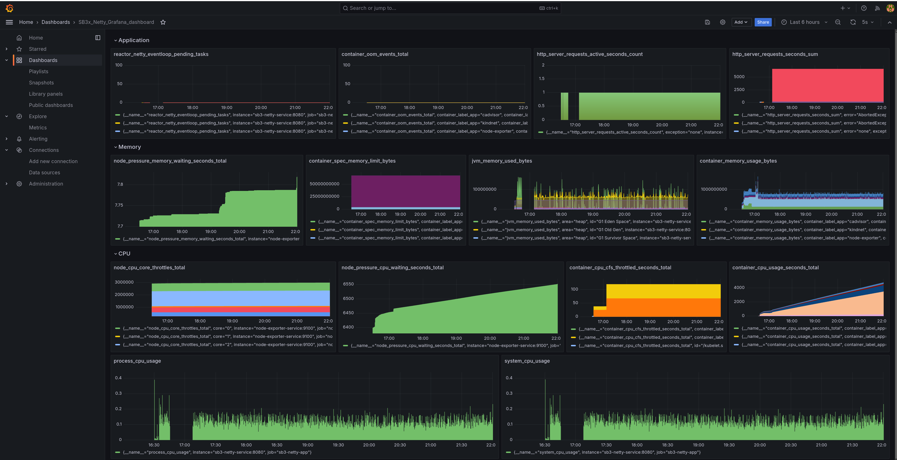
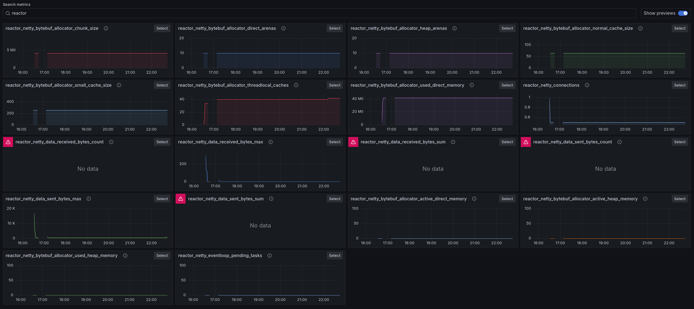
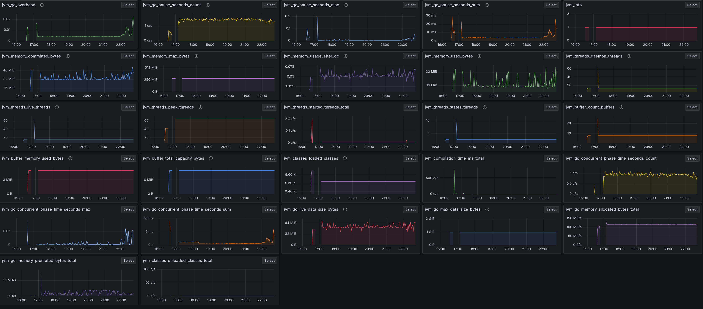

### Findings

* Node-Exporter + cAdvisor expose metrics to Prometheus (a lot of them)
* CPU Back pressure is real, CPU is not high, usage looks low. You need look a spesific metric to see it.
* Netty eventloop is not the bottleneck, it's the CPU backpressure from k8s/linux.

### Stress

```bash
./stress-slow-5s.sh
```
```json
❯ ./test.sh
HTTP/1.1 200 OK
Content-Type: application/vnd.spring-boot.actuator.v3+json
Content-Length: 384

{"status":"UP","components":{"customHealthCheck":{"status":"UP","details":{"ID":"f9ab9b6c-9ad9-486e-bee8-7ac74d09c53d","time":0}},"diskSpace":{"status":"UP","details":{"total":490577010688,"free":66137403392,"threshold":10485760,"path":"/app/.","exists":true}},"livenessState":{"status":"UP"},"ping":{"status":"UP"},"readinessState":{"status":"UP"}},"groups":["liveness","readiness"]}
HC return in [816.93 seconds]
{
  "status": "UP",
  "components": {
    "customHealthCheck": {
      "status": "UP",
      "details": {
        "ID": "2e86430f-e961-48a6-97a6-ea7bcc78ce0f",
        "time": 0
      }
    },
    "diskSpace": {
      "status": "UP",
      "details": {
        "total": 490577010688,
        "free": 66137358336,
        "threshold": 10485760,
        "path": "/app/.",
        "exists": true
      }
    },
    "livenessState": {
      "status": "UP"
    },
    "ping": {
      "status": "UP"
    },
    "readinessState": {
      "status": "UP"
    }
  },
  "groups": [
    "liveness",
    "readiness"
  ]
}
```

Grafana / Prometheus (Node Exporter + cAdvisor + Spring Boot Actuator Metrics)


Metrics:
```
container_cpu_cfs_throttled_seconds_total
container_cpu_usage_seconds_total
node_cpu_core_throttles_total
node_pressure_cpu_waiting_seconds_total
process_cpu_usage
system_cpu_usage
container_spec_memory_limit_bytes
node_pressure_memory_waiting_seconds_total
jvm_memory_used_bytes
container_memory_usage_bytes
reactor_netty_eventloop_pending_tasks
container_oom_events_total
http_server_requests_seconds_sum
http_server_requests_active_seconds_count
```

Reactor Netty metrics are pretty flat...


JVM is ok...



...and we got some restarts... 
```
❯ kubectl get all
NAME                                 READY   STATUS    RESTARTS        AGE
pod/cadvisor-bhb2h                   1/1     Running   2 (5h43m ago)   20h
pod/cadvisor-jr2l4                   1/1     Running   2 (5h43m ago)   20h
pod/grafana-f8f8fb469-zrh74          1/1     Running   2 (5h43m ago)   21h
pod/node-exporter-6dr46              1/1     Running   2 (5h43m ago)   20h
pod/node-exporter-tc68x              1/1     Running   2 (5h43m ago)   20h
pod/prometheus-6b687b7bb5-cbggt      1/1     Running   2 (5h43m ago)   20h
pod/sb3-netty-app-845d6968b8-9ptns   1/1     Running   2 (5h43m ago)   21h

NAME                            TYPE        CLUSTER-IP     EXTERNAL-IP   PORT(S)    AGE
service/cadvisor-service        ClusterIP   10.96.76.114   <none>        8080/TCP   20h
service/grafana                 ClusterIP   10.96.92.111   <none>        80/TCP     21h
service/kubernetes              ClusterIP   10.96.0.1      <none>        443/TCP    21h
service/node-exporter-service   ClusterIP   10.96.147.36   <none>        9100/TCP   20h
service/prometheus              ClusterIP   10.96.18.16    <none>        80/TCP     21h
service/sb3-netty-service       ClusterIP   10.96.198.53   <none>        8080/TCP   21h

NAME                           DESIRED   CURRENT   READY   UP-TO-DATE   AVAILABLE   NODE SELECTOR   AGE
daemonset.apps/cadvisor        2         2         2       2            2           <none>          20h
daemonset.apps/node-exporter   2         2         2       2            2           <none>          20h

NAME                            READY   UP-TO-DATE   AVAILABLE   AGE
deployment.apps/grafana         1/1     1            1           21h
deployment.apps/prometheus      1/1     1            1           21h
deployment.apps/sb3-netty-app   1/1     1            1           21h

NAME                                       DESIRED   CURRENT   READY   AGE
replicaset.apps/grafana-f8f8fb469          1         1         1       21h
replicaset.apps/prometheus-6b687b7bb5      1         1         1       21h
replicaset.apps/sb3-netty-app-845d6968b8   1         1         1       21h
```
```
 kubectl describe pod sb3-netty-app-845d6968b8-9ptns
Name:             sb3-netty-app-845d6968b8-9ptns
Namespace:        default
Priority:         0
Service Account:  default
Node:             grafana-worker2/172.18.0.4
Start Time:       Sun, 25 Aug 2024 00:50:36 -0700
Labels:           app=sb3-netty-app
                  pod-template-hash=845d6968b8
Annotations:      <none>
Status:           Running
IP:               10.244.2.2
IPs:
  IP:           10.244.2.2
Controlled By:  ReplicaSet/sb3-netty-app-845d6968b8
Containers:
  sb3-netty-app:
    Container ID:   containerd://60d5f3ddbbebadbc86d9154a2edc6ac0292578ccc2496618bf4b88417af8f66b
    Image:          sb3-netty:latest
    Image ID:       docker.io/library/import-2024-08-25@sha256:2fef950f1752acac7f0b9ee5470549105af57c713c3187ca8e57315e29083374
    Port:           8080/TCP
    Host Port:      0/TCP
    State:          Running
      Started:      Sun, 25 Aug 2024 16:29:46 -0700
    Last State:     Terminated
      Reason:       Unknown
      Exit Code:    255
      Started:      Sun, 25 Aug 2024 12:10:44 -0700
      Finished:     Sun, 25 Aug 2024 16:29:39 -0700
    Ready:          True
    Restart Count:  2
    Limits:
      cpu:     4095m
      memory:  4Gi
    Requests:
      cpu:     4095m
      memory:  4Gi
    Environment:
      TAG:  sb3-netty-app
    Mounts:
      /var/run/secrets/kubernetes.io/serviceaccount from kube-api-access-x6wkg (ro)
Conditions:
  Type                        Status
  PodReadyToStartContainers   True 
  Initialized                 True 
  Ready                       True 
  ContainersReady             True 
  PodScheduled                True 
Volumes:
  kube-api-access-x6wkg:
    Type:                    Projected (a volume that contains injected data from multiple sources)
    TokenExpirationSeconds:  3607
    ConfigMapName:           kube-root-ca.crt
    ConfigMapOptional:       <nil>
    DownwardAPI:             true
QoS Class:                   Guaranteed
Node-Selectors:              <none>
Tolerations:                 node.kubernetes.io/not-ready:NoExecute op=Exists for 300s
                             node.kubernetes.io/unreachable:NoExecute op=Exists for 300s
Events:                      <none>
```


after waiting some hours and run again... (with no stress) it gets back to normal...
```json
❯ ./test.sh
HTTP/1.1 200 OK
Content-Type: application/vnd.spring-boot.actuator.v3+json
Content-Length: 384

{"status":"UP","components":{"customHealthCheck":{"status":"UP","details":{"ID":"44f9eb76-1f55-4f4f-9f49-efd96ee205c3","time":0}},"diskSpace":{"status":"UP","details":{"total":490577010688,"free":64442724352,"threshold":10485760,"path":"/app/.","exists":true}},"livenessState":{"status":"UP"},"ping":{"status":"UP"},"readinessState":{"status":"UP"}},"groups":["liveness","readiness"]}
HC return in [0.02 seconds]
{
  "status": "UP",
  "components": {
    "customHealthCheck": {
      "status": "UP",
      "details": {
        "ID": "cc2da576-b62c-40e4-a5f5-71fe55ea74a4",
        "time": 0
      }
    },
    "diskSpace": {
      "status": "UP",
      "details": {
        "total": 490577010688,
        "free": 64442728448,
        "threshold": 10485760,
        "path": "/app/.",
        "exists": true
      }
    },
    "livenessState": {
      "status": "UP"
    },
    "ping": {
      "status": "UP"
    },
    "readinessState": {
      "status": "UP"
    }
  },
  "groups": [
    "liveness",
    "readiness"
  ]
}
```

# Links

Netty / Micrometer config
* https://nickolasfisher.com/blog/How-to-Configure-Reactive-Netty-in-Spring-Boot-in-Depth
* https://docs.micrometer.io/micrometer/reference/reference/netty.html
