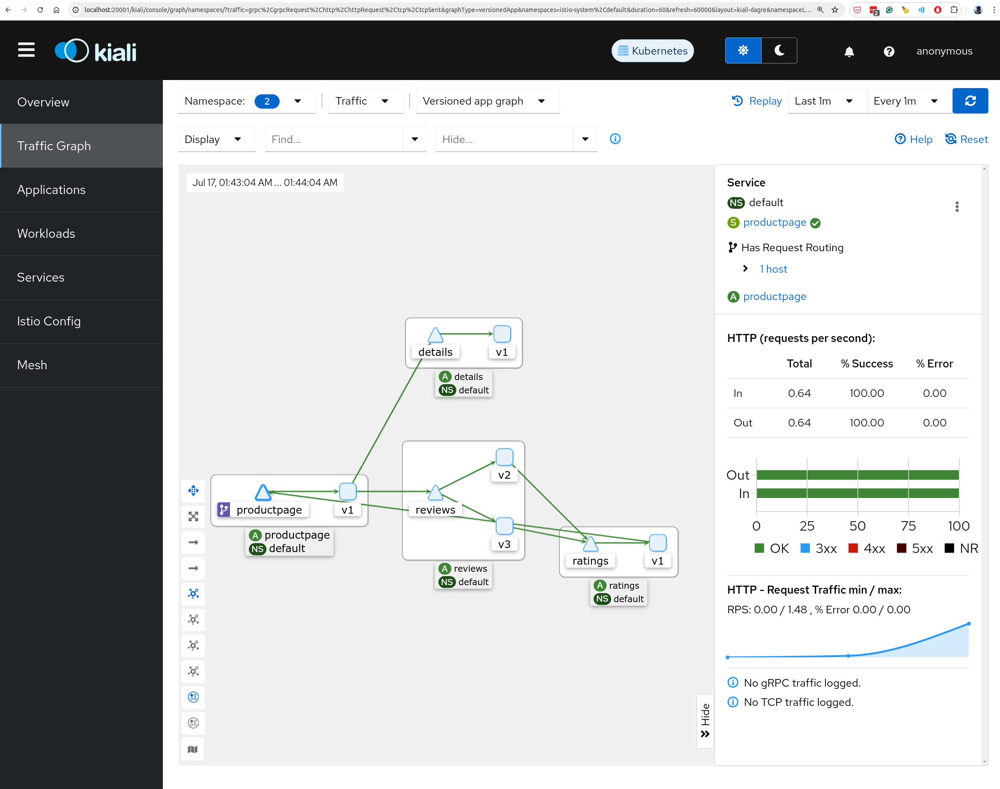

```
Istio: 1.22.3
```

### Steps

Install istio
```
curl -L https://istio.io/downloadIstio | sh -
cd istio-1.22.3/
export PATH=$PWD/bin:$PATH
```

### Create a cluster

kind-config.yaml
```yaml
kind: Cluster
apiVersion: kind.x-k8s.io/v1alpha4
nodes:
- role: control-plane
  extraPortMappings:
  - containerPort: 30080
    hostPort: 80
    protocol: TCP
  - containerPort: 30443
    hostPort: 443
    protocol: TCP
```
```
kind create cluster --name istio --config kind-config.yaml
```
```
❯ kind create cluster --name istio --config kind-config.yaml

Creating cluster "istio" ...
 ✓ Ensuring node image (kindest/node:v1.30.0) 🖼
 ✓ Preparing nodes 📦  
 ✓ Writing configuration 📜 
 ✓ Starting control-plane 🕹️ 
 ✓ Installing CNI 🔌 
 ✓ Installing StorageClass 💾 
Set kubectl context to "kind-istio"
You can now use your cluster with:

kubectl cluster-info --context kind-istio

Have a question, bug, or feature request? Let us know! https://kind.sigs.k8s.io/#community 🙂
```
```
istioctl install --set profile=demo -y
```
```
❯ istioctl install --set profile=demo -y
✔ Istio core installed                                                                                                                                                     
✔ Istiod installed                                                                                                                                                         
✔ Egress gateways installed                                                                                                                                                
✔ Ingress gateways installed                                                                                                                                               
✔ Installation complete                                                                                                                                                    Made this installation the default for injection and validation.

```
```
kubectl label namespace default istio-injection=enabled
```

### Deploy the sample application

```
kubectl apply -f samples/bookinfo/platform/kube/bookinfo.yaml
```
```
❯ kubectl apply -f samples/bookinfo/platform/kube/bookinfo.yaml
service/details created
serviceaccount/bookinfo-details created
deployment.apps/details-v1 created
service/ratings created
serviceaccount/bookinfo-ratings created
deployment.apps/ratings-v1 created
service/reviews created
serviceaccount/bookinfo-reviews created
deployment.apps/reviews-v1 created
deployment.apps/reviews-v2 created
deployment.apps/reviews-v3 created
service/productpage created
serviceaccount/bookinfo-productpage created
deployment.apps/productpage-v1 created
```
Check the app
```
❯ kubectl get services
NAME          TYPE        CLUSTER-IP      EXTERNAL-IP   PORT(S)    AGE
details       ClusterIP   10.96.36.239    <none>        9080/TCP   29s
kubernetes    ClusterIP   10.96.0.1       <none>        443/TCP    23m
productpage   ClusterIP   10.96.222.110   <none>        9080/TCP   28s
ratings       ClusterIP   10.96.182.71    <none>        9080/TCP   29s
reviews       ClusterIP   10.96.47.108    <none>        9080/TCP   28s
❯ kubectl get pods
NAME                              READY   STATUS            RESTARTS   AGE
details-v1-64bcb758dc-nw8hn       2/2     Running           0          34s
productpage-v1-78787b7cdd-jzbcm   0/2     PodInitializing   0          34s
ratings-v1-86bdf4c6c-njhpw        0/2     PodInitializing   0          34s
reviews-v1-867dd8b5b9-x5cnr       0/2     PodInitializing   0          34s
reviews-v2-b4c897c97-n5s4c        0/2     PodInitializing   0          34s
reviews-v3-76f7b975d5-2khw7       0/2     PodInitializing   0          34s

```

Test app is working
```
kubectl exec "$(kubectl get pod -l app=ratings -o jsonpath='{.items[0].metadata.name}')" -c ratings -- curl -sS productpage:9080/productpage | grep -o "<title>.*</title>"
```

openning traffic
```
❯ kubectl apply -f samples/bookinfo/networking/bookinfo-gateway.yaml
gateway.networking.istio.io/bookinfo-gateway created
virtualservice.networking.istio.io/bookinfo created
```

check for no issues
```
❯  istioctl analyze

✔ No validation issues found when analyzing namespace: default.
```

Tunnel
```
kubectl get svc istio-ingressgateway -n istio-system
```
```

```

Kiali
```
kubectl apply -f samples/addons
kubectl rollout status deployment/kiali -n istio-system
```
```
istioctl dashboard kiali
```
generate traffic
```
for i in $(seq 1 100); do kubectl exec "$(kubectl get pod -l app=ratings -o jsonpath='{.items[0].metadata.name}')" -c ratings -- curl -sS productpage:9080/productpage | grep -o "<title>.*</title>"; done
```



```