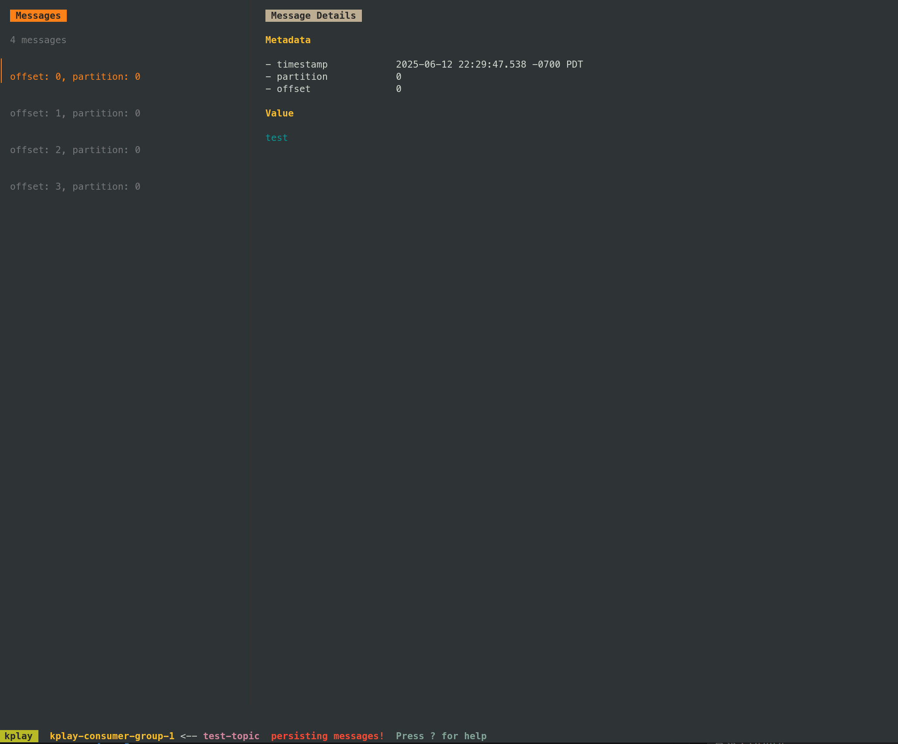

### Run Kafka

```bash
docker-compose up -d
```

### Install kplay

```bash
go install github.com/dhth/kplay@latest
```

### create topic

```bash
docker exec -it kafka kafka-topics --create --topic test-topic --partitions 3 --replication-factor 1 --bootstrap-server localhost:9092

docker exec -it kafka kafka-topics --create --topic test-topic-json --partitions 3 --replication-factor 1 --bootstrap-server localhost:9092

```

### List topics

```bash
docker exec -it kafka kafka-topics --list --bootstrap-server localhost:9092
```

### Produce messages

```bash
docker exec -it kafka kafka-console-producer --topic test-topic --bootstrap-server localhost:9092
```

### Run kplay

```bash
cp .config/kplay/kplay.yml ~/.config/kplay/
kplay -p local-kafka
```

### Result

