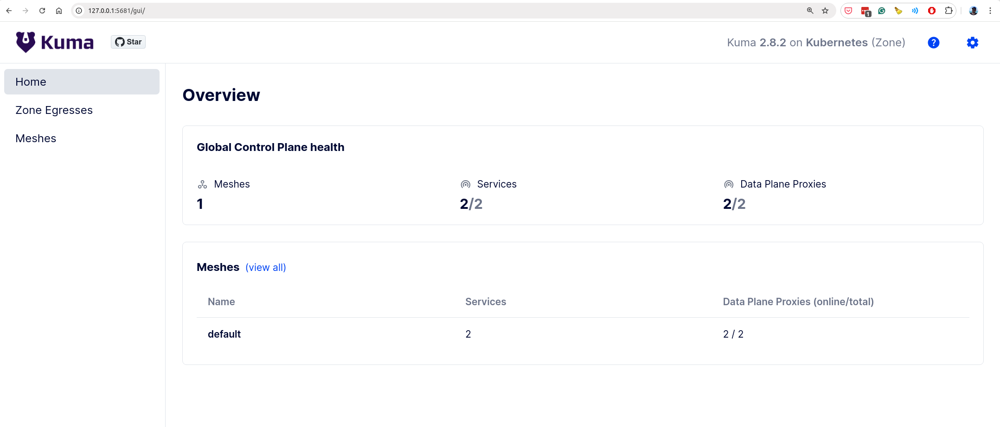

### Commands - Step by Step

1. create a kind cluster (k8s)
```
kind create cluster --name=mesh-zone
kubectl cluster-info --context kind-mesh-zone
```

2. Install Kuma

```
helm repo add kuma https://kumahq.github.io/charts
helm repo update
helm install --create-namespace --namespace kuma-system kuma kuma/kuma
```

```
❯ helm repo add kuma https://kumahq.github.io/charts

"kuma" has been added to your repositories
❯ helm repo update

Hang tight while we grab the latest from your chart repositories...
...Successfully got an update from the "kuma" chart repository
...Successfully got an update from the "traefik" chart repository
...Successfully got an update from the "elastic" chart repository
...Successfully got an update from the "istio" chart repository
...Successfully got an update from the "openfaas" chart repository
...Successfully got an update from the "k8ssandra" chart repository
...Successfully got an update from the "banzaicloud-stable" chart repository
Update Complete. ⎈Happy Helming!⎈
❯ ls
README.md
❯ helm install --create-namespace --namespace kuma-system kuma kuma/kuma

NAME: kuma
LAST DEPLOYED: Mon Aug 19 18:13:56 2024
NAMESPACE: kuma-system
STATUS: deployed
REVISION: 1
TEST SUITE: None
NOTES:
kuma has been installed!

Your release is named 'kuma'.

You can access the control-plane via either the GUI, kubectl, the HTTP API, or the kumactl CLI.
```

3. Install Kumactl

```
curl -L https://docs.konghq.com/mesh/installer.sh | VERSION=2.8.2 sh -
cd kong-mesh-2.8.2/bin
export PATH=$(pwd):$PATH
```

4. Deploy demo app

```
kubectl apply -f https://raw.githubusercontent.com/kumahq/kuma-counter-demo/master/demo.yaml

kubectl wait -n kuma-demo --for=condition=ready pod --selector=app=demo-app --timeout=90s
```
goto http://127.0.0.1:5000/

5. Forward port for UI

```
kubectl port-forward svc/kuma-control-plane -n kuma-system 5681:5681

kubectl port-forward svc/demo-app -n kuma-demo 5000:5000
```

6. Extra

6.1 Enable traffic permissions

```
echo "apiVersion: kuma.io/v1alpha1
kind: MeshTrafficPermission
metadata:
  namespace: kuma-system
  name: mtp
spec:
  targetRef:
    kind: Mesh
  from:
    - targetRef:
        kind: Mesh
      default:
        action: Allow" | kubectl apply -f -
```

6.2 Enable mTLS 

```
echo "apiVersion: kuma.io/v1alpha1
kind: Mesh
metadata:
  name: default
spec:
  mtls:
    enabledBackend: ca-1
    backends:
    - name: ca-1
      type: builtin" | kubectl apply -f -
```

6.3 Allow traffic from demo app to redis

```
echo "
apiVersion: kuma.io/v1alpha1
kind: MeshTrafficPermission
metadata:
  namespace: kuma-system
  name: redis
spec:
  targetRef:
    kind: MeshService
    name: redis_kuma-demo_svc_6379
  from:
    - targetRef:
        kind: MeshSubset
        tags:
          kuma.io/service: demo-app_kuma-demo_svc_5000
      default:
        action: Allow" | kubectl apply -f -
```

http://127.0.0.1:5681/gui

7. Enable Observability

```
kumactl install observability | kubectl apply -f -

kubectl port-forward svc/grafana -n mesh-observability 9090:80
```
goto http://localhost:9090/ username: admin password: 


### Results




