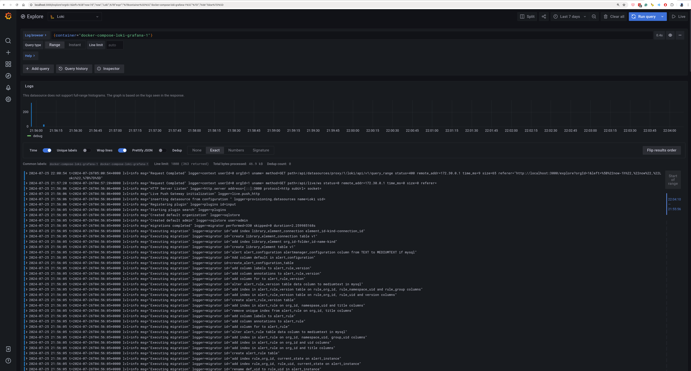

### Run

```
./run.sh
```
```
docker ps
```
```
❯ docker ps
CONTAINER ID   IMAGE                    COMMAND                  CREATED          STATUS          PORTS                                       NAMES
f69f4ed5a515   grafana/promtail:3.0.0   "/usr/bin/promtail -…"   31 seconds ago   Up 30 seconds                                               promtail
59e9ebb8904a   grafana/loki:3.0.0       "/usr/bin/loki -conf…"   44 seconds ago   Up 43 seconds   0.0.0.0:3100->3100/tcp, :::3100->3100/tcp   loki
```
To view readiness, navigate to http://localhost:3100/ready.
To view metrics, navigate to http://localhost:3100/metrics.

### Run docker-compose

```
cd docker-compose-loki/
./run.sh
```
Links after docker-compose is up:
* http://localhost:3101/ready?pg=oss-loki&plcmt=quick-links
* http://localhost:3102/ready?pg=oss-loki&plcmt=quick-links
* http://localhost:12345/
* http://localhost:3000/


### Result on browser

```
http://localhost:3000/explore?orgId=1&left=%5B%22now-7d%22,%22now%22,%22Loki%22,%7B%22expr%22:%22%7Bcontainer%3D%5C%22docker-compose-loki-grafana-1%5C%22%7D%22,%22hide%22:false%7D%5D
```
```
{container="docker-compose-loki-grafana-1"}
```

