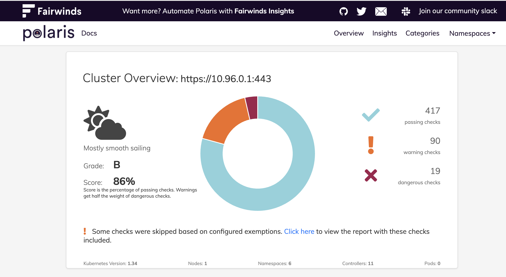

<div align="center" class="no-border">
  
  <br>
  <h3>Polaris is an open source policy engine for Kubernetes</h3>
  <a href="https://github.com/FairwindsOps/polaris/releases">
    
  </a>
  <a href="https://goreportcard.com/report/github.com/FairwindsOps/polaris">
    
  </a>
  <a href="https://circleci.com/gh/FairwindsOps/polaris">
    
  </a>
  <a href="https://insights.fairwinds.com/gh/FairwindsOps/polaris">
    
  </a>
</div>

Polaris is an open source policy engine for Kubernetes that validates and remediates resource configuration. It includes 30+ built in configuration policies, as well as the ability to build custom policies with JSON Schema. When run on the command line or as a mutating webhook, Polaris can automatically remediate issues based on policy criteria.

Polaris can be run in three different modes:
* As a [dashboard](https://polaris.docs.fairwinds.com/dashboard) - Validate Kubernetes resources against policy-as-code.
* As an [admission controller](https://polaris.docs.fairwinds.com/admission-controller) - Automatically reject or modify workloads that don't adhere to your organization's policies.
* As a [command-line tool](https://polaris.docs.fairwinds.com/infrastructure-as-code) - Incorporate policy-as-code into the CI/CD process to test local YAML files.
<p align="center">
  
</p>

## Documentation
Check out the [documentation at docs.fairwinds.com](https://polaris.docs.fairwinds.com)

<!-- Begin boilerplate -->
## Join the Fairwinds Open Source Community

The goal of the Fairwinds Community is to exchange ideas, influence the open source roadmap,
and network with fellow Kubernetes users.
[Chat with us on Slack](https://join.slack.com/t/fairwindscommunity/shared_invite/zt-2na8gtwb4-DGQ4qgmQbczQyB2NlFlYQQ)

## Other Projects from Fairwinds

Enjoying Polaris? Check out some of our other projects:
* [Goldilocks](https://github.com/FairwindsOps/Goldilocks) - Right-size your Kubernetes Deployments by compare your memory and CPU settings against actual usage
* [Pluto](https://github.com/FairwindsOps/Pluto) - Detect Kubernetes resources that have been deprecated or removed in future versions
* [Nova](https://github.com/FairwindsOps/Nova) - Check to see if any of your Helm charts have updates available
* [rbac-manager](https://github.com/FairwindsOps/rbac-manager) - Simplify the management of RBAC in your Kubernetes clusters

Or [check out the full list](https://www.fairwinds.com/open-source-software?utm_source=polaris&utm_medium=polaris&utm_campaign=polaris)
## Fairwinds Insights
If you're interested in running Polaris in multiple clusters,
tracking the results over time, integrating with Slack, Datadog, and Jira,
or unlocking other functionality, check out
[Fairwinds Insights](https://fairwinds.com/insights),
a platform for auditing and enforcing policy in Kubernetes clusters.

## Results

```bash
❯ ./test.sh
=========================================
Testing Polaris Validation
=========================================

Checking if cluster is running...
enabling experimental podman provider

Checking Polaris deployment...
NAME                READY   UP-TO-DATE   AVAILABLE   AGE
polaris-dashboard   2/2     2            2           104s

Checking test deployments...
NAME       READY   UP-TO-DATE   AVAILABLE   AGE
bad-app    1/1     1            1           74s
good-app   0/1     1            0           74s

Installing Polaris CLI...
  % Total    % Received % Xferd  Average Speed   Time    Time     Time  Current
                                 Dload  Upload   Total   Spent    Left  Speed
  0     0    0     0    0     0      0      0 --:--:-- --:--:-- --:--:--     0
  0     0    0     0    0     0      0      0 --:--:-- --:--:-- --:--:--     0
100 15.1M  100 15.1M    0     0   764k      0  0:00:20  0:00:20 --:--:--  743k

Running Polaris audit on bad-deployment...
Polaris audited Path - at 2025-10-06T21:08:19-07:00
    Nodes: 0 | Namespaces: 0 | Controllers: 1
    Final score: 52

Deployment bad-app in namespace default
    pdbMinAvailableGreaterThanHPAMinReplicas 🎉 Success
        Reliability - PDB and HPA are correctly configured
    deploymentMissingReplicas            😬 Warning
        Reliability - Only one replica is scheduled
    metadataAndInstanceMismatched        😬 Warning
        Reliability - Label app.kubernetes.io/instance must match metadata.name
    missingPodDisruptionBudget           😬 Warning
        Reliability - Should have a PodDisruptionBudget
    hostPathSet                          🎉 Success
        Security - HostPath volumes are not configured
    priorityClassNotSet                  😬 Warning
        Reliability - Priority class should be set
    topologySpreadConstraint             😬 Warning
        Reliability - Pod should be configured with a valid topology spread constraint
    hostIPCSet                           🎉 Success
        Security - Host IPC is not configured
    hostPIDSet                           🎉 Success
        Security - Host PID is not configured
    hostProcess                          🎉 Success
        Security - Privileged access to the host check is valid
    missingNetworkPolicy                 😬 Warning
        Security - A NetworkPolicy should match pod labels and contain applied egress and ingress rules
    procMount                            🎉 Success
        Security - The default /proc masks are set up to reduce attack surface, and should be required
    automountServiceAccountToken         😬 Warning
        Security - The ServiceAccount will be automounted
    hostNetworkSet                       🎉 Success
        Security - Host network is not configured
  Container nginx
    dangerousCapabilities                🎉 Success
        Security - Container does not have any dangerous capabilities
    hostPortSet                          🎉 Success
        Security - Host port is not configured
    runAsPrivileged                      🎉 Success
        Security - Not running as privileged
    sensitiveContainerEnvVar             🎉 Success
        Security - The container does not set potentially sensitive environment variables
    livenessProbeMissing                 😬 Warning
        Reliability - Liveness probe should be configured
    notReadOnlyRootFilesystem            😬 Warning
        Security - Filesystem should be read only
    privilegeEscalationAllowed           ❌ Danger
        Security - Privilege escalation should not be allowed
    runAsRootAllowed                     ❌ Danger
        Security - Should not be allowed to run as root
    linuxHardening                       😬 Warning
        Security - Use one of AppArmor, Seccomp, SELinux, or dropping Linux Capabilities to restrict containers using unwanted privileges
    memoryLimitsMissing                  😬 Warning
        Efficiency - Memory limits should be set
    memoryRequestsMissing                😬 Warning
        Efficiency - Memory requests should be set
    readinessProbeMissing                😬 Warning
        Reliability - Readiness probe should be configured
    tagNotSpecified                      ❌ Danger
        Reliability - Image tag should be specified
    cpuLimitsMissing                     😬 Warning
        Efficiency - CPU limits should be set
    cpuRequestsMissing                   😬 Warning
        Efficiency - CPU requests should be set
    insecureCapabilities                 😬 Warning
        Security - Container should not have insecure capabilities
    pullPolicyNotAlways                  🎉 Success
        Reliability - Image pull policy is "Always"


Running Polaris audit on good-deployment...
Polaris audited Path - at 2025-10-06T21:08:19-07:00
    Nodes: 0 | Namespaces: 0 | Controllers: 1
    Final score: 85

Deployment good-app in namespace default
    deploymentMissingReplicas            😬 Warning
        Reliability - Only one replica is scheduled
    metadataAndInstanceMismatched        😬 Warning
        Reliability - Label app.kubernetes.io/instance must match metadata.name
    missingPodDisruptionBudget           😬 Warning
        Reliability - Should have a PodDisruptionBudget
    pdbMinAvailableGreaterThanHPAMinReplicas 🎉 Success
        Reliability - PDB and HPA are correctly configured
    missingNetworkPolicy                 😬 Warning
        Security - A NetworkPolicy should match pod labels and contain applied egress and ingress rules
    topologySpreadConstraint             😬 Warning
        Reliability - Pod should be configured with a valid topology spread constraint
    hostNetworkSet                       🎉 Success
        Security - Host network is not configured
    priorityClassNotSet                  😬 Warning
        Reliability - Priority class should be set
    procMount                            🎉 Success
        Security - The default /proc masks are set up to reduce attack surface, and should be required
    automountServiceAccountToken         😬 Warning
        Security - The ServiceAccount will be automounted
    hostIPCSet                           🎉 Success
        Security - Host IPC is not configured
    hostPIDSet                           🎉 Success
        Security - Host PID is not configured
    hostPathSet                          🎉 Success
        Security - HostPath volumes are not configured
    hostProcess                          🎉 Success
        Security - Privileged access to the host check is valid
  Container nginx
    livenessProbeMissing                 🎉 Success
        Reliability - Liveness probe is configured
    cpuLimitsMissing                     🎉 Success
        Efficiency - CPU limits are set
    linuxHardening                       🎉 Success
        Security - One of AppArmor, Seccomp, SELinux, or dropping Linux Capabilities are used to restrict containers using unwanted privileges
    privilegeEscalationAllowed           🎉 Success
        Security - Privilege escalation not allowed
    pullPolicyNotAlways                  😬 Warning
        Reliability - Image pull policy should be "Always"
    runAsRootAllowed                     🎉 Success
        Security - Is not allowed to run as root
    cpuRequestsMissing                   🎉 Success
        Efficiency - CPU requests are set
    hostPortSet                          🎉 Success
        Security - Host port is not configured
    notReadOnlyRootFilesystem            🎉 Success
        Security - Filesystem is read only
    readinessProbeMissing                🎉 Success
        Reliability - Readiness probe is configured
    sensitiveContainerEnvVar             🎉 Success
        Security - The container does not set potentially sensitive environment variables
    runAsPrivileged                      🎉 Success
        Security - Not running as privileged
    dangerousCapabilities                🎉 Success
        Security - Container does not have any dangerous capabilities
    insecureCapabilities                 🎉 Success
        Security - Container does not have any insecure capabilities
    memoryLimitsMissing                  🎉 Success
        Efficiency - Memory limits are set
    memoryRequestsMissing                🎉 Success
        Efficiency - Memory requests are set
    tagNotSpecified                      🎉 Success
        Reliability - Image tag is specified


=========================================
Validation Summary
=========================================

Bad deployment should show multiple validation failures:
  - Missing resource requests/limits
  - Missing liveness/readiness probes
  - Running as root
  - Using latest tag

Good deployment should show passing validation or minimal warnings

You can also access the Polaris dashboard with:
  kubectl port-forward -n polaris svc/polaris-dashboard 8080:80
  Then open http://localhost:8080
```

## UI

