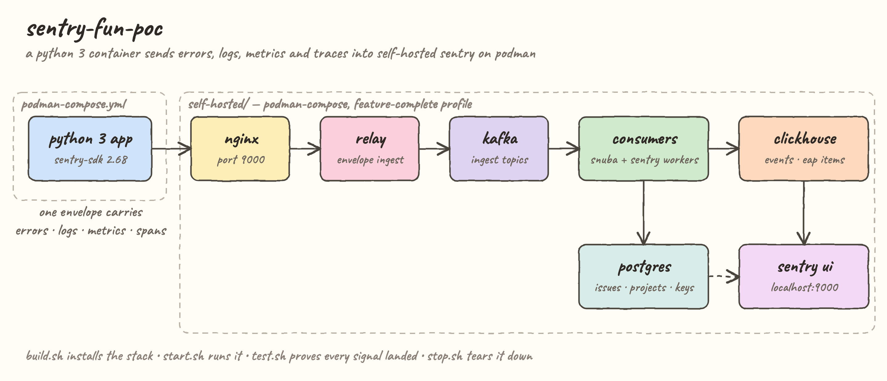
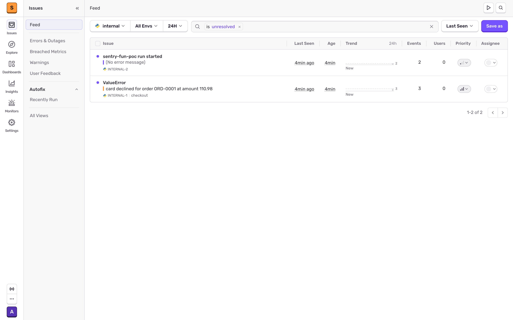
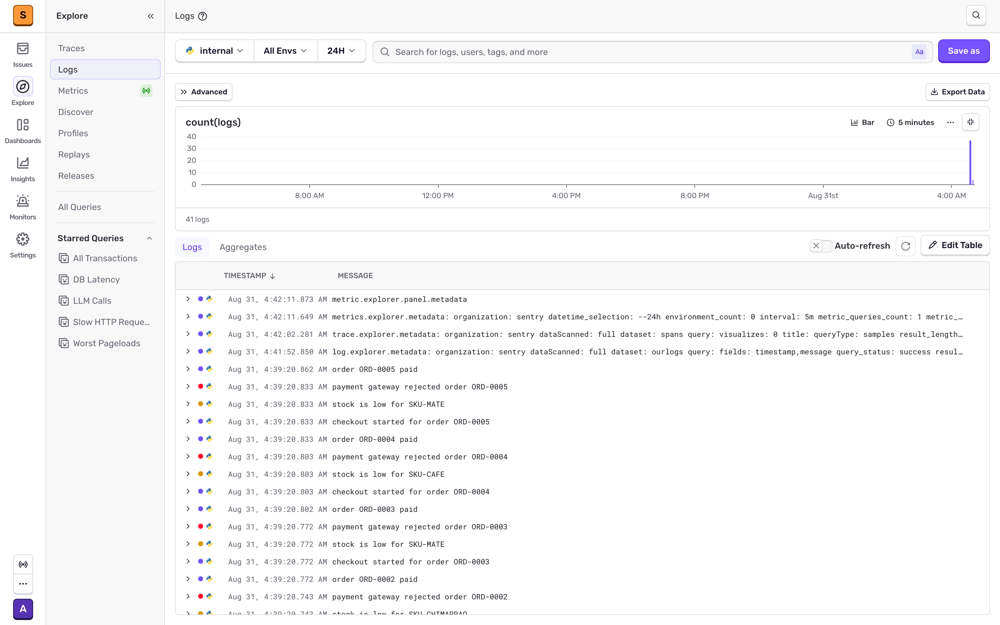
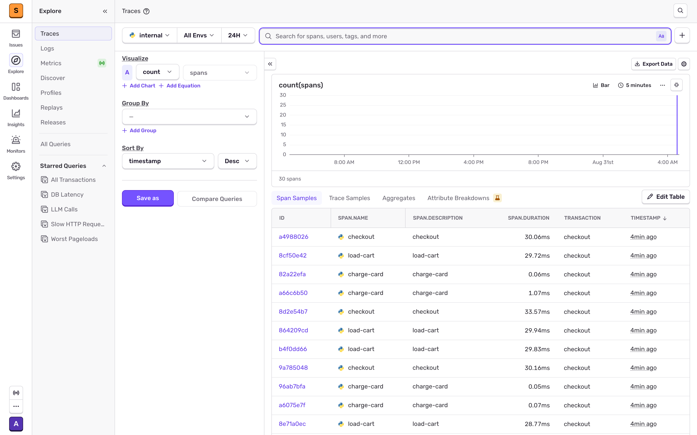
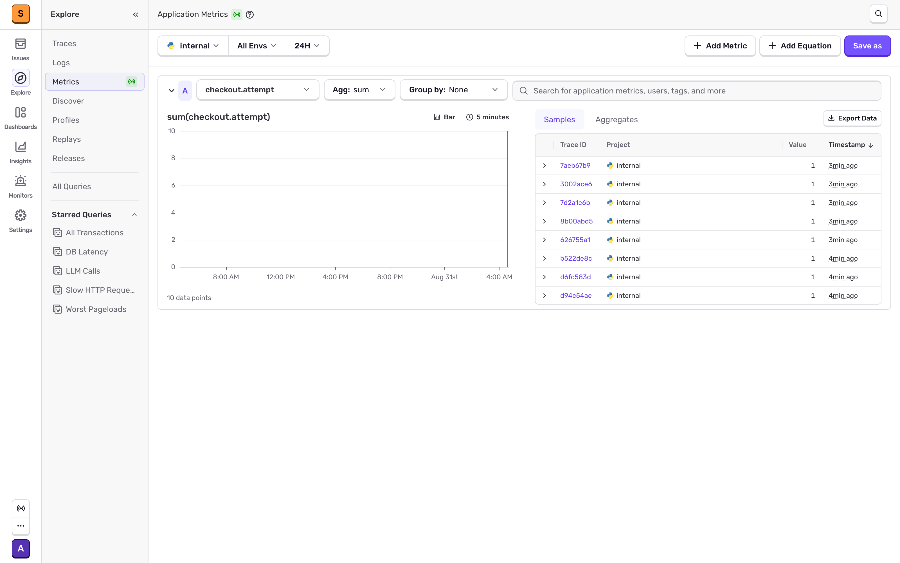

A proof of concept that runs the real **[getsentry/self-hosted](https://github.com/getsentry/self-hosted)** Sentry stack entirely on **podman / podman-compose** and points a small **Python 3** app at it. The app emits the four signals Sentry ingests — errors, structured logs, trace metrics and distributed traces — and `test.sh` proves each one actually reached storage instead of just claiming it did.

## How it Works?

`build.sh` clones `getsentry/self-hosted`, applies four small patches so the upstream installer can drive podman on Apple Silicon, and runs `install.sh --container-engine-podman`. That brings up roughly forty containers under the `feature-complete` profile.

`start.sh` boots the stack, waits on `/_health/`, creates a superuser, completes Sentry's first-run setup wizard non-interactively, then reads the project's public key straight out of Postgres to build a DSN at runtime. No DSN is ever written to disk. The Python app runs as its own `podman-compose` service joined to the stack's network, so it addresses Sentry as `nginx` rather than guessing at host gateways.

Inside one transaction the app writes logs, records three metric types, and captures a real exception. The SDK batches all of it into Sentry envelopes, which travel through nginx to relay, into Kafka, and out to ClickHouse and Postgres via the snuba and sentry consumers.

## Architecture



## Features

- **Runs on podman, not docker** — the upstream installer is driven through its supported `--container-engine-podman` path, and the app ships as a `podman-compose.yml` service.
- **All four Sentry signals from one app** — errors, logs, metrics and traces are emitted inside a single traced transaction, so they correlate in the UI.
- **DSN resolved at runtime from Postgres** — nothing to copy-paste from the UI, and no credential file in the repo.
- **`test.sh` verifies storage, not exit codes** — it snapshots row counts in ClickHouse, runs the app, then waits for every count to move.
- **Zero manual setup** — machine sizing, bash 5, the superuser and Sentry's first-run wizard are all handled by the scripts.
- **Upstream stays upstream** — `self-hosted/` is cloned and gitignored, and the patches are re-applied from a pristine `git checkout` every build, so the POC never forks Sentry.

## Stack

- **Python 3.14** — the app runtime, slim base image.
- **sentry-sdk 2.68.1** — the only dependency; it carries the logs and trace-metrics APIs.
- **getsentry/self-hosted (master)** — the actual Sentry product, minus billing and Seer.
- **podman 5 + podman-compose 1.5** — container engine and orchestration, no docker daemon.
- **PostgreSQL 14** — issues, projects and project keys; also where the DSN is read from.
- **ClickHouse** — events, transactions and EAP items; logs and metrics both live here.
- **Kafka + relay + snuba** — the ingest path between the SDK and storage.

## Contracts / APIs

The app is a producer, not a server, so the contract is Sentry's ingest surface.

| Method | Endpoint | Purpose |
| --- | --- | --- |
| `POST` | `/api/{project_id}/envelope/` | The single endpoint the SDK posts to. One envelope carries error events, log items, metric items and span/transaction payloads. Auth is the DSN public key in the `X-Sentry-Auth` header. |
| `GET` | `/_health/` | Returns `200 ok` once web is serving. `start.sh` and `test.sh` block on this. |
| `GET` | `/api/0/organizations/sentry/issues/` | Sentry Web API for issues, if you want to script against it. |

The DSN itself is the contract between app and stack:

```
http://<public_key>@nginx/<project_id>              from inside the compose network
http://<public_key>@localhost:9000/<project_id>     from your laptop
```

## Key data structures and design decisions

**Where each signal lands.** This is what `test.sh` asserts on, and it is the only durable map of the pipeline:

| Signal | SDK call | Storage | Row identity |
| --- | --- | --- | --- |
| Errors | `capture_exception` / `capture_message` | ClickHouse `errors_local` | one row per event |
| Traces | `start_transaction` / `start_span` | ClickHouse `transactions_local` | one row per transaction |
| Logs | `sentry_sdk.logger.*` | ClickHouse `eap_items_1_local` | `item_type = 3` |
| Metrics | `sentry_sdk.metrics.*` | ClickHouse `eap_items_1_local` | `item_type = 8` |

Logs and metrics share one table and are told apart only by `item_type`, which is why `test.sh` counts them separately rather than counting the table.

**The app joins the stack's network instead of using `host.containers.internal`.** On Apple Silicon that name resolves to the gvproxy gateway (`192.168.127.254`), which does not reach ports published by other rootless containers. Joining `sentry-self-hosted_default` and addressing `nginx` is deterministic, and the network name is discovered from the running nginx container rather than assumed.

**`feature-complete` profile is mandatory, not optional.** Sentry Logs and Trace Metrics are stored as EAP items, and the `snuba-eap-items-consumer` that writes them only exists in that profile. The `errors-only` profile fits in 8 GB but silently drops two of the four signals, so the scripts force `COMPOSE_PROFILES=feature-complete` and size the podman machine to 16 GB / 6 CPU to clear the installer's hard 14000 MB / 4 CPU check.

**Verification counts events, not issue groups.** Sentry groups every `ValueError` from the same stack frame into one issue, so `sentry_groupedmessage` does not grow on a second run. Counting `errors_local` in ClickHouse does, which makes `test.sh` repeatable.

### Patches applied to upstream

`install.sh` does not currently complete on Apple Silicon under podman. `patch_self_hosted()` in `lib.sh` restores both files from git and re-applies these every build, so it is idempotent and never drifts:

| File | Problem | Fix |
| --- | --- | --- |
| `install/detect-platform.sh` | Accepts `aarch64`, but `podman info` reports `arm64`, so the installer aborts immediately. | Accept both. |
| `install/dc-detect-version.sh` | Picks `podman compose` because it reports a higher version — but podman delegates that to Homebrew's real `docker-compose`, which rejects podman-only flags (`unknown flag: --in-pod`). | Force the standalone `podman-compose`. |
| `install/dc-detect-version.sh` | podman-compose reads only `--profile` and ignores the `COMPOSE_PROFILES` env var, so every `feature-complete` service is invisible and the install dies on a missing `vroom`. | Pass `--profile` explicitly. |
| `install/dc-detect-version.sh` | Upstream runs one-off containers with `--in-pod=false` while `up` puts services in a pod; podman refuses cross-pod dependencies (`container dependency … is part of a pod, but container is not`). | Run the whole project pod-free. |

Sentry's first-run wizard is also completed programmatically: it is gated on the `sentry:version-configured` option plus every `FLAG_REQUIRED` option being set, so `complete_setup()` sets them through `sentry django shell` instead of leaving you a form to fill in.

## Prerequisites

Tested on macOS 15 / Apple Silicon with rootless podman. The upstream patches below target that combination specifically; on Linux x86 the stock `install.sh` already works and this POC's app half still applies.

| Requirement | Why |
| --- | --- |
| Homebrew | `build.sh` installs bash 5 through it. Sentry's installer needs bash >= 4.4 and macOS ships 3.2. |
| podman 5.x + podman-compose 1.5+ | The engine and the compose implementation. `podman compose` is deliberately not used — see the patch table. |
| An existing podman machine | Default name `podman-machine-default`, override with `MACHINE_NAME`. `build.sh` resizes it, it does not create one. |
| 16 GB free RAM for the machine | The installer hard-fails below 14000 MB on the `feature-complete` profile. |
| ~35 GB free disk | About 12 GB of images plus about 20 GB of ClickHouse, Kafka and Postgres volumes. |
| git, python3, curl | Used by the scripts for cloning, parsing podman JSON and health checks. |

Everything else — bash 5, machine sizing, the superuser, the setup wizard and the DSN — the scripts handle.

## How to run

```bash
./build.sh   # preflight, clone self-hosted, patch, run install.sh, build the app image
./start.sh   # bring the stack up, create the user, complete setup, run the app once
./test.sh    # run the app and assert every signal reached storage
./stop.sh    # tear both down
```

`build.sh` is the slow one — it pulls about 12 GB of images and runs the full database migration. `start.sh` and `test.sh` take a couple of minutes each. `build.sh` also resizes the podman machine to 16 GB / 6 CPU and installs Homebrew bash if either is below what the installer requires.

Sentry UI: <http://localhost:9000> · login `admin@sentry.local` / `sentry-fun-poc`

Useful knobs, all environment variables:

| Variable | Default | Meaning |
| --- | --- | --- |
| `RUNS` | `5` | How many checkout transactions the app sends. |
| `SENTRY_PORT` | `9000` | Host port nginx publishes on. |
| `SENTRY_EMAIL` / `SENTRY_PASSWORD` | `admin@sentry.local` / `sentry-fun-poc` | Superuser the scripts create. |
| `SELF_HOSTED_REF` | `master` | Branch or tag of `getsentry/self-hosted` to clone. |
| `POLL_LIMIT` | `180` | Seconds `test.sh` waits for ingestion before failing. |

### Test output

```
$ ./test.sh
[sentry-poc] sentry is healthy on http://localhost:9000
[sentry-poc] baseline errors=5 transactions=10 logs=59 metrics=77
[sentry-poc] superuser admin@sentry.local already exists
[sentry-poc] sentry setup already completed
[sentry-poc] running the python app with RUNS=5
[app] sentry initialized against nginx/1
[app] order ORD-0001 done in 47.7ms
[app] captured exception for order ORD-0002
[app] order ORD-0002 done in 49.1ms
[app] order ORD-0003 done in 19.3ms
[app] order ORD-0004 done in 29.1ms
[app] order ORD-0005 done in 50.3ms
[app] flushed 5 checkouts to sentry
[sentry-poc] waiting for sentry to ingest the payloads
sentry-fun-poc results after 0s
  PASS  errors         5 -> 8
  PASS  transactions   10 -> 15
  PASS  logs           59 -> 77
  PASS  metrics        77 -> 92
[sentry-poc] all signals reached sentry, browse them at http://localhost:9000
```

## Printscreens

### Issues



The two issues the app produced. `ValueError: card declined for order ORD-0001 at amount 110.98` is the exception raised inside the `charge-card` span and passed to `capture_exception`, grouped across 3 events; `sentry-fun-poc run started` is the `capture_message` fired once per run, at 2 events. Both are tagged to the `internal` project and the `checkout` transaction.

### Logs



Sentry Logs, fed by `sentry_sdk.logger`. The three severities the app emits per checkout are visible by their colour dots — `checkout started for order …` (info), `stock is low for SKU-…` (warning) and `payment gateway rejected order …` (error) — plus `order … paid` on the runs where the charge succeeded. The count and the bar chart confirm all 37 log items were ingested through the EAP pipeline.

### Traces



The span samples for the same run. Each `checkout` transaction (~30 ms) contains a `load-cart` span (~29 ms, the simulated DB query) and a `charge-card` span (well under 1 ms, the fast in-process call that raises). 30 spans total across 10 transactions, which is what makes the errors, logs and metrics correlate — they all carry the same trace id.

### Metrics



Application Metrics with `sum(checkout.attempt)` selected — the counter the app increments once per checkout, attributed by `sku`. The Samples panel on the right lists each individual metric emission with its trace id, so a metric data point links back to the exact transaction that produced it. The app also sends a `checkout.cart_size` gauge and a `checkout.latency` distribution, selectable from the same dropdown.
