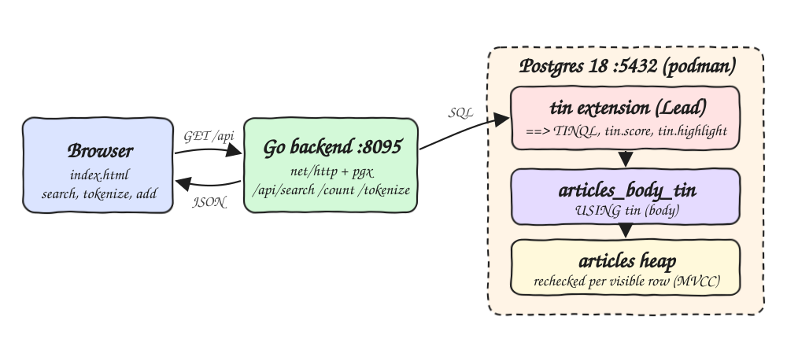
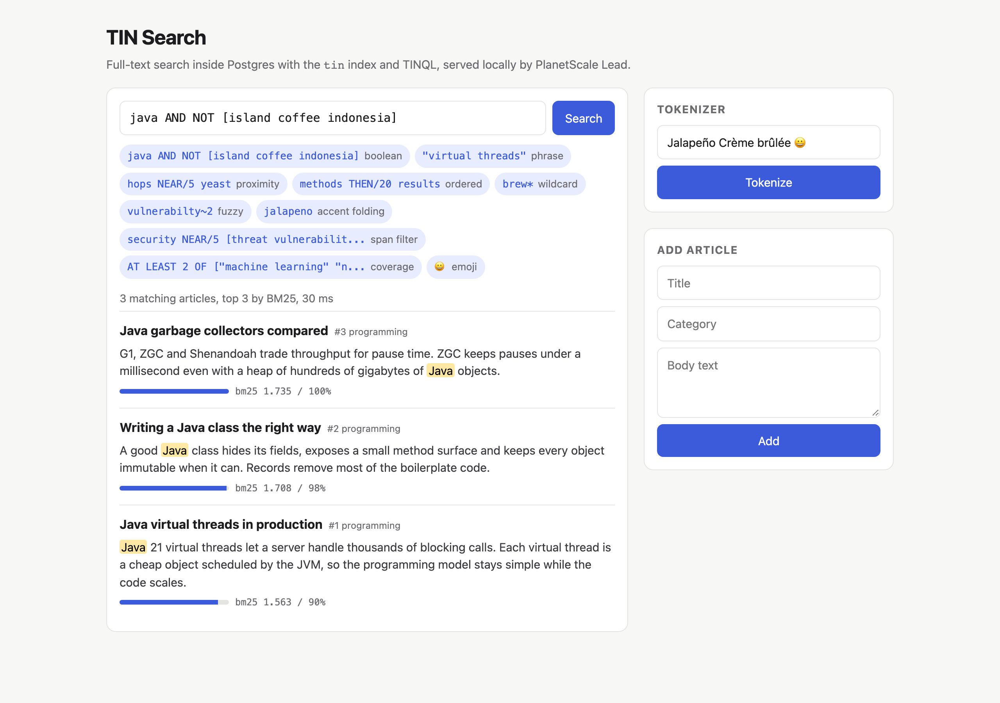
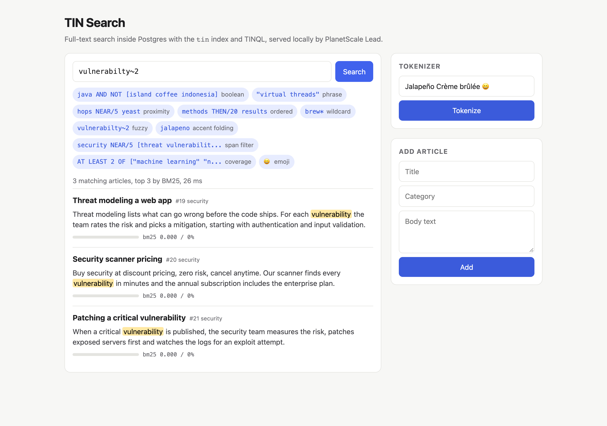
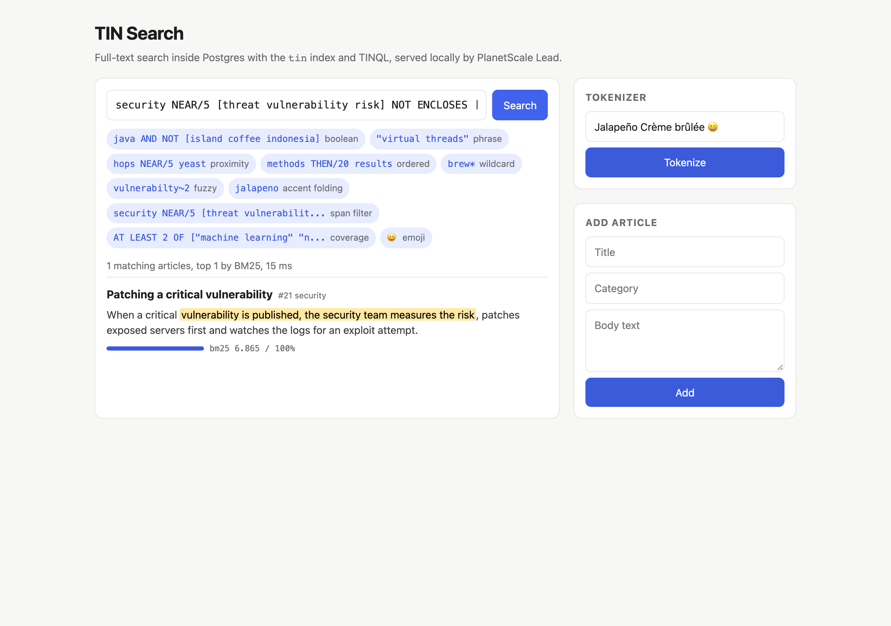
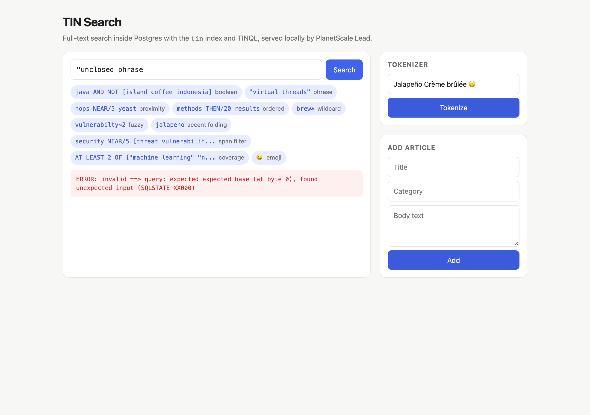
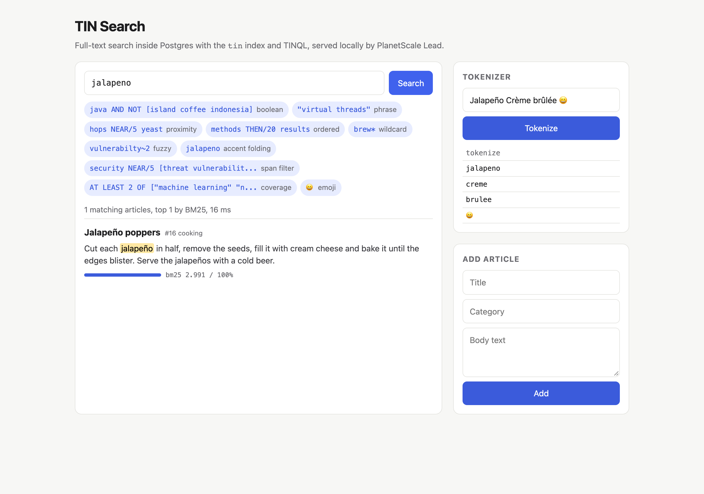

# tin-postgres-fun

A POC of [TIN](https://planetscale.com/blog/introducing-tin), the PlanetScale full-text search extension for Postgres ("Text INdex", GA on 2026-09-16). TIN only runs on PlanetScale, so this POC runs it locally through [Lead](https://github.com/planetscale/lead). Lead is the open-source, TIN-compatible extension that PlanetScale publishes for local development and CI. It exposes the same `tin` extension name, the `tin` access method, the `==>` operator, the TINQL query language, `tin.score`, `tin.highlight` and `tin.tokenize`. The same SQL runs on a PlanetScale database with the real TIN.

The POC builds Postgres 18 with Lead compiled from source and seeds 30 articles picked to exercise every TIN feature. It has a small Go API and a one-page UI for running TINQL queries, viewing BM25 rankings and highlights, tokenizing text and adding articles live.

## How it Works?

1. `postgres/Containerfile` compiles Lead with `cargo pgrx package` for Postgres 18 (pinned to Lead commit `bd95c7e`, pgrx `0.19.1`, Rust `1.96.0`). It copies the resulting `tin.so` and control files into a stock `postgres:18` image.
2. `postgres/init.sql` runs `CREATE EXTENSION tin`, creates the `articles` table, seeds 30 articles and creates `articles_body_tin USING tin (body)`.
3. The Go backend sends the user's TINQL string to Postgres as a bind parameter: `WHERE body ==> $1`.
4. Ranking uses `tin.score(ctid, dense_ratio => 1.0)` (full BM25), and `tin.highlight(body, '⟦', '⟧')` marks the matched spans.
5. The UI escapes the snippet and turns the markers into `<mark>` tags, so user-added text cannot inject HTML.
6. Lead scans every heap page and Postgres rechecks each visible row. Results are exact and MVCC-correct, but it is not the fast TIN engine.

## Architecture



## Features

* **TINQL in SQL**: one `==>` predicate supports boolean, phrase, proximity, ordered, span and coverage queries, and still combines with normal `WHERE` clauses.
* **BM25 ranking**: results are ordered by `tin.score` and normalized against the best match, so the score bar means something.
* **Highlighting**: `tin.highlight` returns the exact span that matched, not just the words.
* **Fuzzy and wildcard terms**: `vulnerabilty~2` survives typos and `brew*` expands to brewing, brewery and brewer.
* **Case, accent and emoji folding**: `jalapeno` finds `Jalapeño`, `CREME` finds `Crème`, and `😀` is a searchable term.
* **Tokenizer inspector**: `tin.tokenize` shows exactly what gets indexed, which is the first thing to check when a query returns zero rows.
* **Live writes**: articles added through the API are searchable right after commit and stay invisible before it.
* **Syntax errors as 400**: a broken TINQL query returns the parser message to the user instead of a 500.

## Stack

* **Postgres 18**: the TIN docs list 17 and 18 as the supported versions for Lead.
* **Lead (Rust + pgrx)**: the only way to run TIN SQL outside PlanetScale.
* **Podman + podman-compose**: builds the extension image and runs the database.
* **Go 1.26 stdlib `net/http`**: serves the API and the embedded UI from one binary with no framework.
* **pgx v5**: the only dependency. Go has no Postgres driver in the stdlib.
* **Plain HTML + JS**: one embedded file, with no build step and no node_modules.

## Contracts/APIs

| Method | Path | Params | Response |
|---|---|---|---|
| GET | `/api/health` | - | `{"status":"ok"}` |
| GET | `/api/search` | `q` TINQL (required), `limit` 1..50 (default 10) | `{"query","total","results":[{"id","title","category","snippet","score","relative"}]}` |
| GET | `/api/count` | `q` TINQL | `{"query","total"}` |
| GET | `/api/tokenize` | `text` | `{"text","tokens":[{"tokenize":"jalapeno"}]}` |
| POST | `/api/articles` | JSON `{"title","category","body"}` | `201 {"id"}` |

Errors are always `{"error":"..."}`: `400` for a missing or invalid parameter or bad TINQL, `500` when the database is unavailable.

```bash
curl 'http://localhost:8095/api/search?q=java%20AND%20NOT%20%5Bisland%20coffee%5D'
curl 'http://localhost:8095/api/tokenize?text=Jalape%C3%B1o'
curl -X POST localhost:8095/api/articles -H 'Content-Type: application/json' \
  -d '{"title":"Stout","category":"beer","body":"A stout uses roasted malt and a clean ale yeast"}'
```

TINQL queries to try in the UI or in `./scripts/sql-console.sh`:

```sql
SELECT id, title FROM articles WHERE body ==> 'java AND NOT [island coffee indonesia]';
SELECT id, title FROM articles WHERE body ==> '"virtual threads"';
SELECT id, title FROM articles WHERE body ==> 'hops NEAR/5 yeast';
SELECT id, title FROM articles WHERE body ==> 'methods BEFORE results';
SELECT id, title FROM articles WHERE body ==> 'vulnerabilty~2';
SELECT id, title FROM articles WHERE body ==> 'AT LEAST 2 OF ["machine learning" "neural network" "training data"]';
SELECT id, tin.score(ctid, dense_ratio => 1.0) AS s, tin.highlight(body)
  FROM articles WHERE body ==> 'yeast OR hops' ORDER BY s DESC LIMIT 5;
SELECT * FROM tin.tokenize('Jalapeño Crème brûlée 😀');
```

## Key data structures and design decisions

* **One table, one TIN index**: `articles(id, title, category, body)` with `USING tin (body)`. Each TIN index covers one text column.
* **`dense_ratio => 1.0` on `tin.score`**: by default `tin.score` skips terms that appear in more than 10% of documents, which is a speed shortcut for big corpora. In a 30-row corpus, `java` appears in 5 of 30 docs and scored `0`. Setting it to 1.0 gives the full BM25 value (identical to `tin.full_score`).
* **Relative score computed in Go, not with `tin.max_score`**: `tin.max_score` uses the default `dense_ratio`, so dividing by it produced 0% and 141% bars. `tin.score` also refuses to run under a window function or subquery, because it must bind to the `==>` scan at the same query level. Rows already come back ordered by score, so the first row is the maximum.
* **Wildcard terms score 0**: `brew*` matches, but wildcard expansions carry no BM25 weight, so the backend guards the division.
* **`NOT ENCLOSES` filters spans, not documents**: it removes a match only when the excluded words sit inside the matched span. Words elsewhere in the document do not count.
* **Non-HTML highlight markers** (`⟦ ⟧`): the backend never returns HTML, and the UI escapes first and marks second.
* **Pinned build**: Lead commit, pgrx and Rust versions are pinned in the Containerfile, so the image is reproducible.
* **Lead is not TIN**: Lead stores no postings, so there is nothing here to benchmark. It is for correctness only, and the performance claims in the blog post (8x or more) apply only to TIN on PlanetScale.

## How to run the app/tests

Requires podman, podman-compose and Go 1.26. The first `setup.sh` compiles Lead in Rust and takes several minutes.

```bash
./scripts/setup.sh
./scripts/start-all.sh
./scripts/test-all.sh
./scripts/ui.sh
./scripts/stop-all.sh
```

`test-all.sh` runs 18 Go tests: 6 unit tests for the HTTP contract and 12 integration tests against the real extension (boolean exclusion, accent folding, fuzzy, wildcard, word order, phrase adjacency, span filtering, BM25 order, relative score bounds, MVCC visibility, parse errors). It then smoke-tests the running API with curl.

## Printscreens

**Boolean search.** `java AND NOT [island coffee indonesia]` keeps only the 3 programming articles and drops Java the island and Java the coffee. Each result shows the highlighted match and its BM25 score relative to the best result.



**Fuzzy search.** The misspelled `vulnerabilty~2` still finds every article about a vulnerability, because TIN allows up to 2 edits per term.



**Span filter.** `security NEAR/5 [threat vulnerability risk] NOT ENCLOSES [buy pricing discount]` keeps the real security write-up and drops the sales pitch, whose security-to-risk span contains "discount pricing". The highlight shows the whole matching span.



**BM25 ranking.** `yeast OR hops` ranks the article with the most hops and yeast mentions for its length first (100%). Other articles follow at 70% and 54%.


**TINQL error.** An unclosed phrase is rejected by the TINQL parser, and the message is shown to the user as a 400 rather than a server error.



**Tokenizer and accent folding.** `tin.tokenize` shows that `Jalapeño Crème brûlée 😀` is indexed as `jalapeno`, `creme`, `brulee` and `😀`, which is why typing `jalapeno` finds `Jalapeño poppers`.



## Scripts

All scripts live in `scripts/` and run from any directory of the repository.

| Script | What it does |
|---|---|
| `./scripts/setup.sh` | Builds the Postgres 18 + Lead image and the Go backend |
| `./scripts/start-all.sh` | Starts every service and prints the full link of each one |
| `./scripts/status.sh` | Shows every service port as UP or DOWN |
| `./scripts/test-all.sh` | Runs every test suite |
| `./scripts/ui.sh` | Opens the UI in the browser |
| `./scripts/stop-all.sh` | Stops every service |
| `./scripts/sql-console.sh` | Opens psql on the `search` database |

Ports are declared in `scripts/ports.env`: postgres `5432`, backend `8095`.

```bash
./scripts/setup.sh
./scripts/start-all.sh
./scripts/status.sh
./scripts/ui.sh
./scripts/stop-all.sh
```
