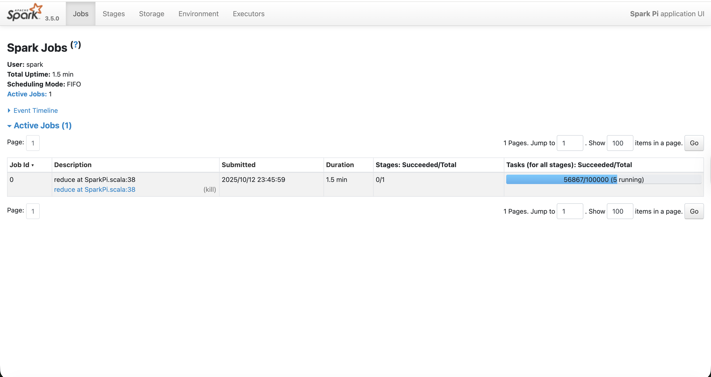
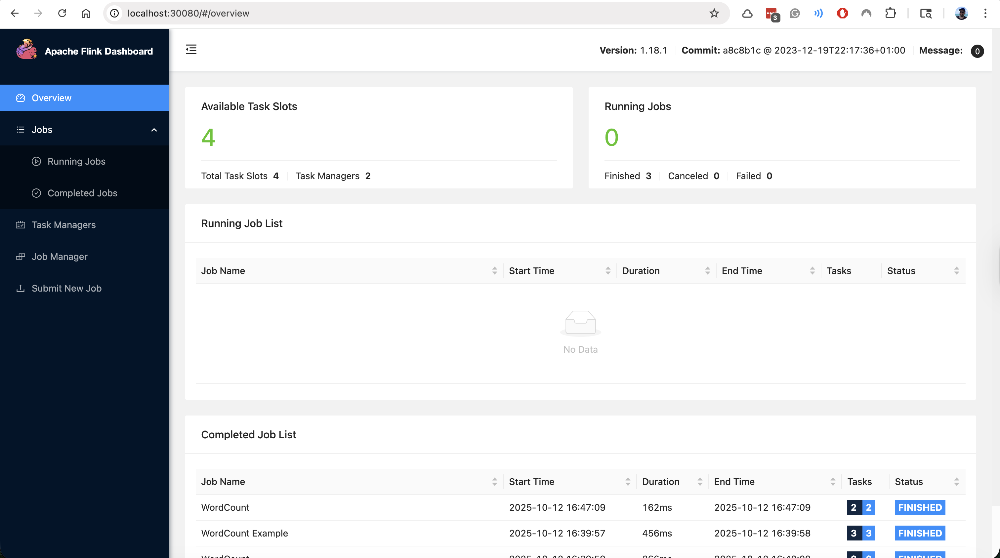

# Volcano

Volcano is a batch system built on Kubernetes, designed to run high-performance workloads such as machine learning, deep learning, and big data jobs. It provides advanced scheduling capabilities, resource management, and job orchestration to efficiently utilize cluster resources.

https://volcano.sh/en/

## Features

- **Advanced Scheduling**: Supports gang scheduling, queue management, and priority-based scheduling to ensure efficient resource allocation for batch jobs.
- **Resource Management**: Allows fine-grained control over resource allocation, including CPU, memory, and GPU resources.
- **Job Orchestration**: Provides a unified interface for submitting,
monitoring, and managing batch jobs.
- **Extensibility**: Designed to be extensible, allowing users to customize scheduling policies and integrate with other systems.
- **Multi-Tenancy**: Supports multi-tenant environments, enabling different users or teams to share the same cluster while maintaining isolation.
- **Integration with Kubernetes**: Leverages Kubernetes' native capabilities, making it easy to deploy and manage in existing Kubernetes environments.
- **Support for Various Workloads**: Can handle a wide range of workloads, including MPI jobs, TensorFlow jobs, and Spark jobs.
- **Web UI and CLI**: Provides both a web-based user interface and command-line tools for managing jobs and resources.
- **Metrics and Monitoring**: Integrates with monitoring tools to provide insights into job performance and resource utilization.
- **Fault Tolerance**: Designed to handle node failures and job restarts gracefully, ensuring high availability of batch jobs.

## Results 

Spark  

Flink  
